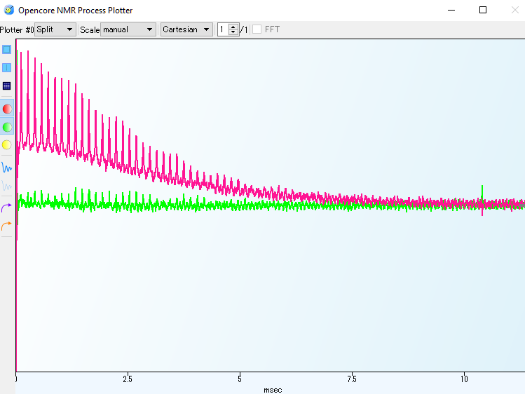

# Getting Started with a 5 mm CPMAS probe

We assume that you alrerady have a system that works. That is, we assume that you have a system composed of an Opencore NMR spectrometer, a magnet, a probe, power amplifiers, a low-noise amplifier, and so on. Here I will describe below experimental settings toward 1H-13C CPMAS in our ca. 7 T magnet.

- **TODO**: photos

### A single-pulse <sup>79</sup>Br experiment in KBr
-  Rotor ID: 33L1012 (KBr 50 mg, adamantane 48.6 mg mixture)

##### Finding the right condition
- Frequency:  75.0469 MHz
- Sample position (how far you insert the probe into the magnet bore): 360 mm above the bottom flange of the magnet.
- Amplitude of the rf pulse and its optimal duration

##### Adjustment of the magic angle
- We started repeat scanning of 79Br FID from KBr powder spinning at ca. 7 kHz, and observed rotational echoes.
- By inspecting the FIDs, we adjusted the knob on the probe dedicated for magic-angle adjustment, so that the train of the rotational echoes lasted as long as possible. Then we believed that the spinning axis became close to ideal, i.e., *the magic angle* $\cos^{-1}(1/\sqrt{3})$.  



### A single-pulse <sup>1</sup>H experiments and a single-pulse <sup>13</sup>C experiments in adamantane
We have two tasks:  
- Finding the on-resonance frequency  
- Correlating the rf amplitude and the 1H/13C nutation frequencies.

Note that we already have done **linearity correction**. In our case we found out the following transformation rule in the preample assures (almost) linear behavior between the amplitude paramaters and the actual rf amplitudes coming out of the power amplifiers fot channel #1 and #3:

```
transform F1Amp=2.585 
               +2.04524*#
	             -0.0522161*#*#
	             +0.00106271*pow(#,3)
             	 -1.01001e-005*pow(#,4)
	             +3.62161e-008*pow(#,5);

transform F3Amp = 2.02393+2.28478*#
                 -0.0726745*#*#
                 +0.00154882*pow(#,3)
                 -1.60017E-5*pow(#,4)
                 +6.46677E-8*pow(#,5);
```

We found out, from nutation experiments, following *scaling factor*s defined in the preamble allows us to program the amplitudes ***in terms of the nutation frequency in kHz***. 

```
double aXScale=1.1788; 
double aHScale=0.5376; 
```

That is, if we set up the preample like:
```
// 
version=2.0;

uses = defaultGates.gate;
// defaultGates.gate is located in the "gates" folder in the application directory.

transform F1Freq=#+180;
transform F3Freq=#-180;
// DDS(II) signal is to be down-converted with an intermediate frequency of 180 MHz.
// Accordingly, we want it generating the frequency 180 MHz above the carrier freq.
transform F1Amp=2.585 
               +2.04524*#
	-0.0522161*#*#
	+0.00106271*pow(#,3)
	-1.01001e-005*pow(#,4)
	+3.62161e-008*pow(#,5);

transform F3Amp = 2.02393+2.28478*#
                 -0.0726745*#*#
                 +0.00154882*pow(#,3)
                 -1.60017E-5*pow(#,4)
                 +6.46677E-8*pow(#,5);

CLK=160;  // PPG Clock frequency 

freq f1=75.318012; 
freq f1Offset_kHz=0; 

freq f3=299.5239; 

double aXScale=1.1788; 
amp aXCP=25; 
 
double aHScale=0.5376; 
amp aH90=100; 
amp aHCP=25; 
amp aHDec=30; 

time pw90H=2.5u; 
time pwcp=5m; 
time rd=10u(receiver delay); 
time ad=10u(acquisition delay); 

const int AD9858_2GHZ_DISABLE=16472; 
// This is not going to be altered, and thus is declared with "const",
// so that it does not appear in the variable edit table.

//-----  aux parameters  -----
aux PD=3s(Pulse Delay); 
aux NA=20(Number of Accum); 
aux DW=10u(DWell time); 
aux AL=8192(Acquisition Length); 
aux ND=0(Number of Dummy scans); 

//----- phase cycle  -----
phaselist pList=(ch3; y,-y);
acqphase=x,-x;
```

, then we can write, for, say, cross-polarization, as follows:

```
  pulse(10u;                               F1_Unblank,                                     F3_Unblank)
  pulse(pw90H;                             F1_Unblank, F3Amp(aHScale*aH90), pList, F3_Gate, F3_Unblank)
  pulse(pwcp; F1Amp(aXScale*aXCP), F1_Gate, F1_Unblank, F3Amp(aHScale*aHCP), F3_Gate, F3_Unblank)
  pulse(rd;                                           F3Amp(aHScale*aHDec), F3_Gate, F3_Unblank)
  pulse(ad; RG,                                       F3Amp(aHScale*aHDec), F3_Gate, F3_Unblank)
  pulse(dw*al;  ST, RG,                               F3Amp(aHScale*aHDec), F3_Gate, F3_Unblank)
relax   
```

