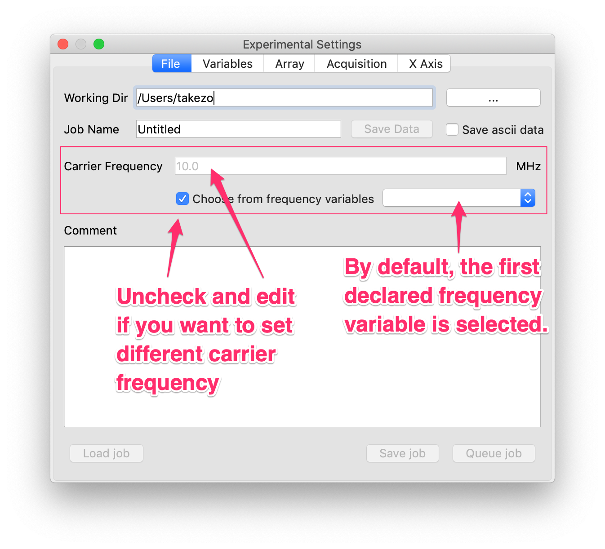
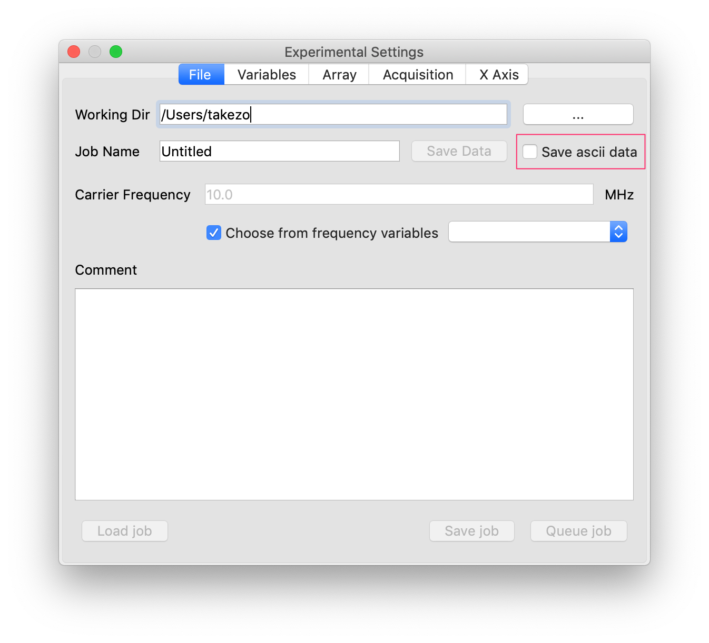
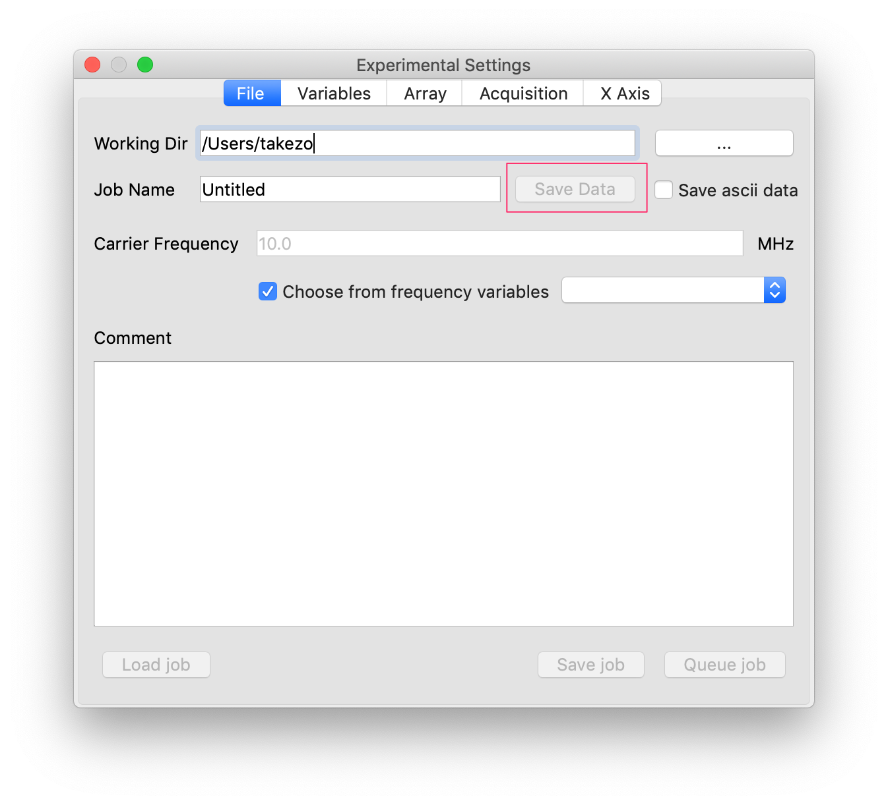
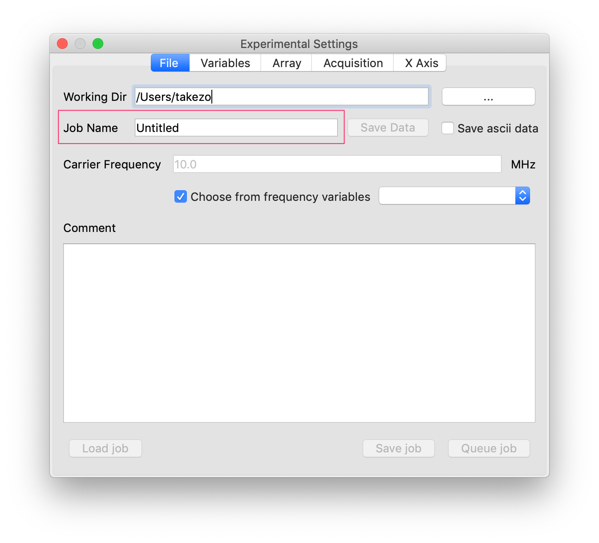

# Data Files
29 Jan 2019 Kazuyuki Takeda
- - -
### Related Topics
- Array Experiments (TODO...)

### Introduction
Here I discuss the format of the data acquired with Opencore NMR 2. At the time of writing this topic, files with the following extensions are created:

extension  | description  | notes
--|---|--
.opd  | double-precision data (binary)  | little endian
.opp  | parameters associated with .opd (text)  |  
.sm2d  | single-precision data (binary)  | little endian
.sm2p  | parameters associated with .sm2p (text)  |  
.opa  | ascii data | optional |


### Double-precision data (.opd and .opp)
- The extensions `opp` and `opd` were named after **op**encore **d**ata and **op**encore **p**arameter.
- A `.opp` file is a text file and can be viewed (and even edited at your own responsibility) with a text editor. The content looks like:
```
point=1024
dw=10
sf1=74.656
#
[Log]
actualNA=100
...
```
- Most important parameters in the `.opp` file is `point`, which carries the number of points, or often called the aquisition length (al), of a single FID data.  
- In the .opd file, the data are saved in **double-precision** and **little-endian byte-order** the following way:
```
QDataStream out(&file);
out.setFloatingPointPrecision(QDataStream::DoublePrecision);
out.setByteOrder(QDataStream::LittleEndian);

for(int m=0; m<al(); m++) out << real->sig.at(m) << imag->sig.at(m);

file.close();
```
- Here, `al()` stands for the number of points, `real->sig.at(m)` is the in-phase (or real) part of the m-th point, `imag->sig.at(m)` is the quadrature (or imaginary) part of the m-th point.
- That is, the in-phase and quadrature parts of the complex data are stored *one after another*, starting from the first (0-th) to the last points.
- If you perform an array experiment and store the data, the arrayed data will be ***appended*** to the identical `.opd` file.

##### dwell time (dw), and carrier frequency (sf1)
- The dwell time `dw` (i.e., sampling-time interval) is supposed to be given in microseconds. This information is of course necessary if you want to plot the data as a function of time. In addition, when you perform Fourier transformation, the width of the resultant spectrum will be given by the inverse of the dwell time.
- The carrier frequency, `sf1`, **given in MHz**, does not have any effect in the time-domain plot. Even in the Fourier-transformed spectrum, `sf1` does not do anything as long as the horizontal axis in represented by frequency (Hz, kHz, MHz, etc.). However, in many cases NMR spectra are plotted in *ppm* (part per million), where we definitely need information the frequency that corresponds to 1 ppm. This very information matches with the carrier frequency represented in terms of MHz, and is specified by `sf1`.
- In general, the software has no means of knowing the carrier frequency, so that the users have to judge it and tell the software. By default, the software ***assumes*** that the frequency variable declared first in the current pulse program is the carrier frequency. If this is what you intend, you do not have to do anything. If this is not the case, however, you will have to tell the software the carrier frequency.



### Single-precision data (.sm2d and .sm2p)
- The format is almost identical to the double-precision data (.opd and .opp) described above. The only difference is that the binary data is stored with *single precision*. The byte order is the same, i.e., little endian. For a single (i.e., non-arrayed) data, the points are stored in the following way:

```
QDataStream out(&file);
out.setFloatingPointPrecision(QDataStream::SinglePrecision);
out.setByteOrder(QDataStream::LittleEndian);

for(int m=0; m<al(); m++) out << (float) real->sig.at(m)
                              << (float) imag->sig.at(m);

file.close();
```
- Again, if you perform an array experiment and store the data, the arrayed data will be ***appended*** to the identical `.sm2d` file.


### .opa
- Named after **op**encore **a**scii format.  
- This is an optional file format in which the text data are saved to a file.
- This option is activated when you check the save ascii checkbox.

- Shown below is a cropped code for creating the `.opa`  file for arrayed data, whence I hope you can tell that in-phase and quadrature data of each point are written in a single line separated by a whitespace, and then line feed follows and the next point is processed. As this is a text file, I hope you can verify the format using a text editor.

```
QFile file(fn);
if (!file.open(flag | QIODevice::Text))
{
     errorMessage=QString(Q_FUNC_INFO)+ ": Failed to open " + fn;
     return false;
}

QTextStream out(&file);

for(int i=0; i<FID.size(); i++)
{
    for(int k=0; k<FID.at(i)->al(); k++)
    {
       out << QString::number(FID.at(i)->real->sig.at(k),'g',12)
           << " "
           << QString::number(FID.at(i)->imag->sig.at(k),'g',12)
           << "\n";
    } // k
    out << "\n";
} // i
file.close();
```
- Note that the size of the file can be very big when you try to store data with a long array.


### Saving data halfway through accumulation
- When the accumulation (sometimes called signal averaging) has been complete, the files of the above data are automatically created. But you may want to save data and check it *halfway through* experiments, i.e., even before the accumulation has been complete.
- During accumulation, `Save Data` button should be enabled. Just click it to save data. In this case, the files with names with a suffix "_unfinished" are created.



### Temporary data files during array increments
When each step of an array experiment has been finished, the data is appended to temporary files with a name with "_array" suffix. You may hopefully find these "_array" files useful, when you want to check the data of already finished array steps. When the whole array experiment has been complete, the "_array" files are deleted.


### Data files created/removed on repeated experiments
- If one experiment has been complete, and then you run the experiments again *without changing any experimental parameters*, the latest data are saved in files with a suffix "_1". That is, the data of the previous accumulations are retained. If you do it again and again (without changing any experimental parameters), then, another data file with a suffix "_2", "_3", ... are created.
- However, ***once you have changed any experimental parameter(s) and try to run another measurement,*** all your previous data in the same working directory will be deleted.
- If this is not what you want, you can just change the job name by editing the "Job name" line edit. Then, the current data will be kept safe and the next data will be saved in a new directory
.


[Back to Top](../../index.md)
