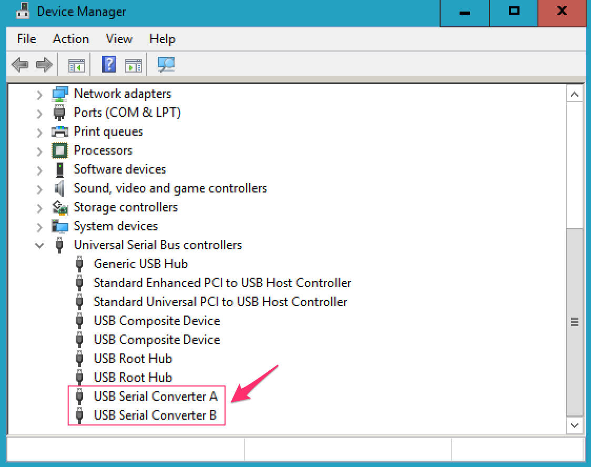

# Driver installation
11 Jan 2019 Kazuyuki Takeda  

Here, let us take a look at how to setup the computer, regarding:
- Device driver  
- software  

We assume you already have an operational Opencore NMR hardware. We also assume that the eprom on the USB board has already been configured. For eprom configuration [see the link](../usb_eprom/mprog.md).

### Driver installation
The way that the driver is to be installed depends on the operating system (Linux, Mac, Windows).

#### Linux
Download a [D2XX driver](https://www.ftdichip.com/Drivers/D2XX.htm) from FTDI, extract the downloaded file, and follow the instruction written in ReadMe.txt. That is:
- Copy the libraries to /usr/local/lib:
`sudo cp libftd2xx.* /usr/local/lib`
- Give non-root access to the shared object:
`sudo chmod 0755 /usr/local/lib/libftd2xx.so.1.4.8`
- Create a symbolic link:
`sudo ln -sf /usr/local/lib/libftd2xx.so.1.4.8 /usr/local/lib/libftd2xx.so`

To enable plug and play feature, follow what is written in [USB Setup on Linux](../USBSetupOnLinux/USBSetupOnLinux.md).

#### Mac
Download a [D2XX driver](https://www.ftdichip.com/Drivers/D2XX.htm) from FTDI, extract the downloaded file, and follow the instruction written in ReadMe.rtf. That is, open a Terminal, and:
- Copy the dylib file to /usr/local/lib:
  `sudo cp Desktop/D2XX/libftd2xx.1.4.4.dylib /usr/local/lib/libftd2xx.1.4.4.dylib`
- Make a symbolic link:
  `sudo ln -sf /usr/local/lib/libftd2xx.1.4.4.dylib /usr/local/lib/libftd2xx.dylib`

To disable the built-in driver, you may have to run  
`sudo kextunload -bundle com.apple.driver.AppleUSBFTDI`
every time you re-connect the USB cable. Whenever this operation is necessary, the console software gives you a message to do so.

#### Windows
- If you plug in the USB cable, the operating system may automatically detect the hardware and install the right driver.  
- To verify if the driver has successfully been installed, open device manager, and see the "Universal Serial Bus controllers".  
- It will be all right if both "USB Serial Converter A" and "USB Serial Converter B" are recognized.  

- If there is something wrong with the driver, you can download a [D2XX driver](https://www.ftdichip.com/Drivers/D2XX.htm) from FTDI.  

### Settings
Clone `.opencorenmr` to the home directory of your computer:
[https://github.com/opencorenmr/.opencorenmr.git](https://github.com/opencorenmr/.opencorenmr.git)

As a result, you will have .opencorenmr directory under your home directory:
- Linux: ~/.opencorenmr, or /home/(username)/.opencorenmr  
- Mac OSX: ~/.opencorenmr, or /Users/(username)/.opencorenmr  
- Windows: C:\\Users\\(username)\\.opencorenmr  

.opnecorenmr directory contains:

- `gates` directory,
- `examples` directory,

as well as `*.ini` files. In `gates` there are *.gates file, which we call ***gate definition*** files. Descriptions on the gate definiton files will be presented elsewhere.
