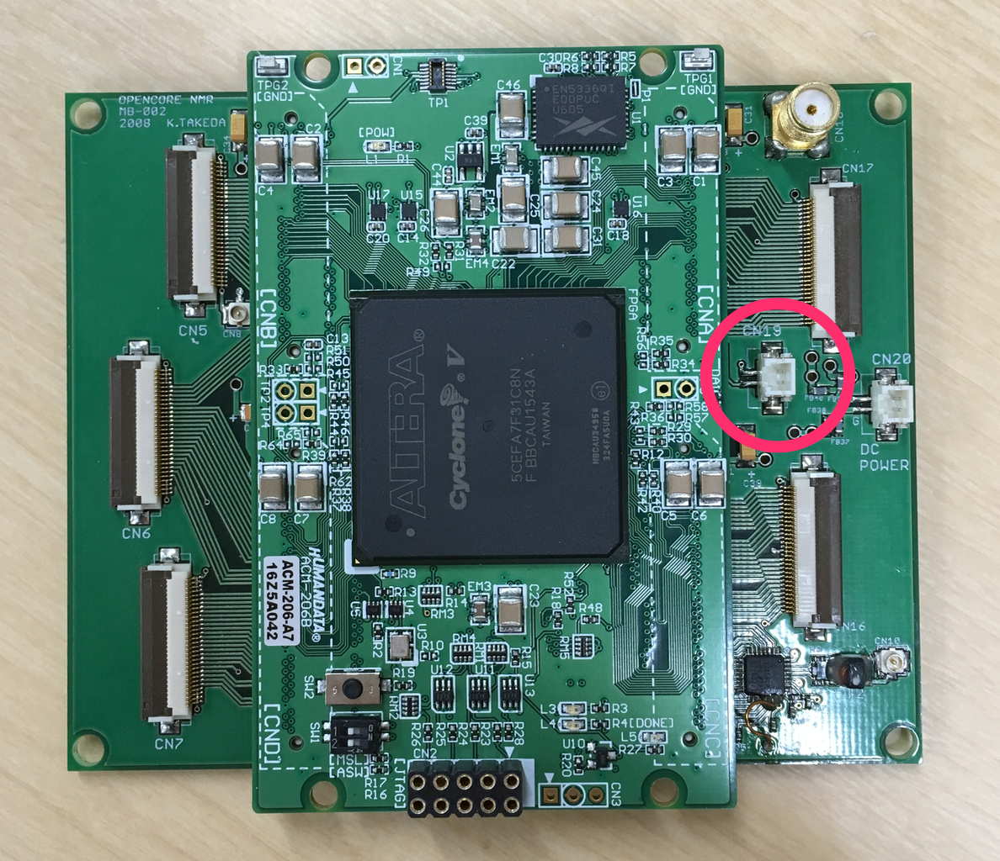

# Waiting for external trigger

12 May 2019 Typo error corrected by KT (exttrig)  
8 Mar 2019 Revised by Kazuyuki Takeda  

- - -

To pause implementation of the pulse programmer until the spectrometer receives external trigger signal, use `exttrig` command.

```
Init
  pulse(pw1; gate1, gate2, ...)
  exttrig
  pulse(pw2; gate3, gate4, ...)
Relax
```

Trigegr signal is to be fed to CN19 of the mother board.



[Back](../../index.md)
