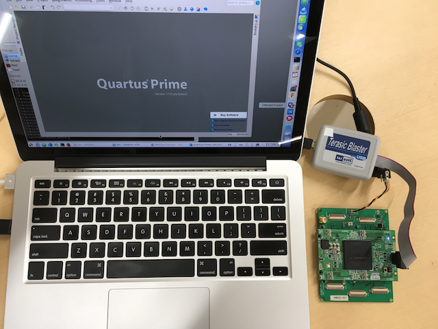
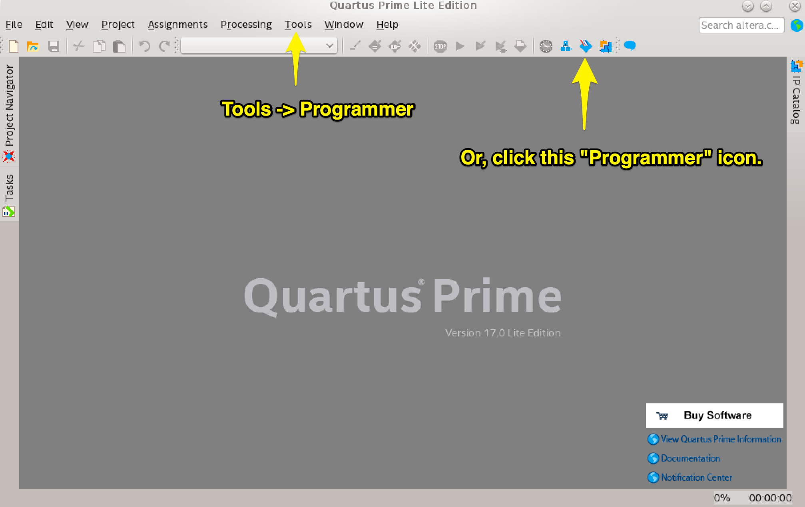
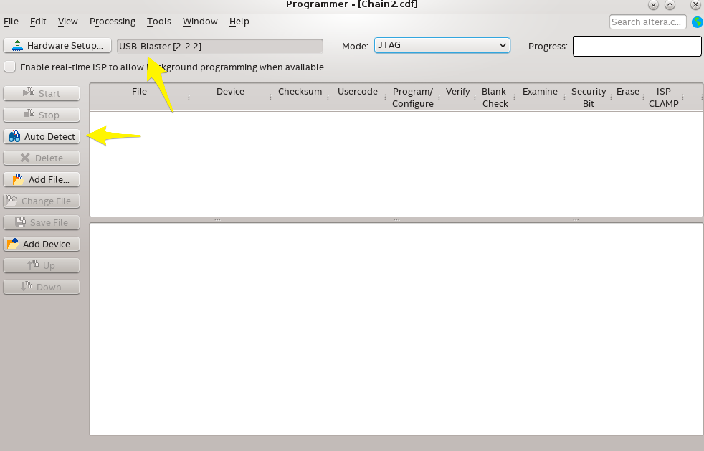
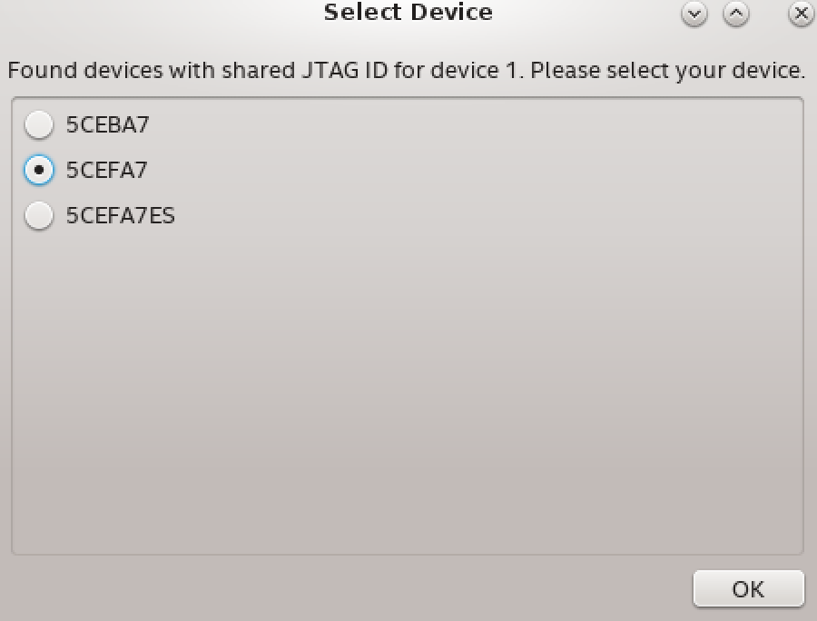
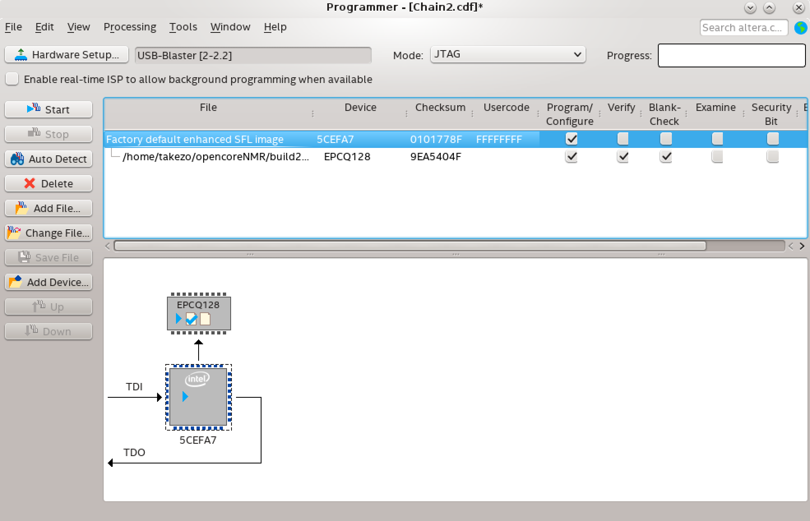

# FPGA Writing
1 Aug 2019 by Kazuyuki Takeda
- - -

##### We assume that
- The compiled (and converted) core-module file, such as [`build2009c-cyclone5.jic`](https://github.com/opencorenmr/fpga-devel-2.0.1/blob/master/cyclone5/output_files/build2009c-cyclone5.jic), has already been downloaded,  
- The FPGA board, ACM-206-A7 (HumanData) is powered,  
- A download cable (e.g., Terasic Blaster) is connected, and  
- The Quartus software has been launched.  

### Step-by-step instruction
- Run the ***Programmer*** from within the Quartus software. This can be done either by pull-down `Tools -> Programmer`, or by clicking an ***Programmer*** icon on the toolbar.
  

- The downloading hardware needs to be recognized. If not, click `Hardware Setup...`, and try to detect the download tool. In the screenshot below, `USB-Blaster [2-2.2]` is detected.

- Next, click `Auto Detect`. After a while, candidates may be displayd. Choose the FPGA that you actually use, and click `OK`. In this example, I use 5CEFA77F31C8N (Cyclone 5), and thus choose `CEFA7`.

- Select the top item in the list view (blue-highlighted in the screenshot below.). Click `Change File...` and choose the core-module file. Then, check `Program/Configure`, `Verify`, and `Blank-Check`, as shown in the screenshot.

- Click `Start`, and wait for a while. The progress bar should show a message "Success".
- Unplug the ribbon cable and disconnect the power supply. The FPGA will work the next time you switch the power supply on. ***Note that you need to switch off and on the power supply for the FPGA to be configured as intended.*** 

- - -
[Back](../index.md)
