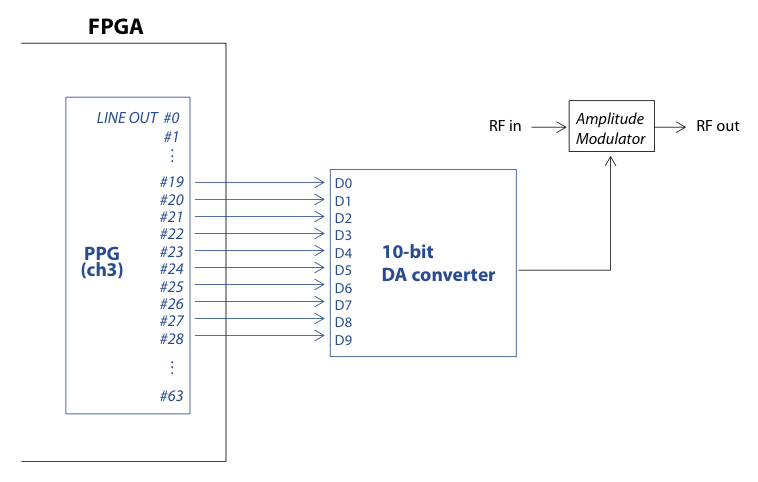


# Gate Definition

29 Jan Kazuyuki Takeda

- - -
### Related Topics
- [Kinds of Gates](../kindsOfGates/kindsOfGates.md)  


### Introduction
A gate definition file is read by the pulse-program compiler upon reception of the uses command:
```
uses=<filename>;
```
In many cases, `uses=defaultGates.gate;` will do. This files are to be placed under `~/.opencorenmr/gates/` (Linux, Mac) or `C:\Users\(username)\.opencorenmr\gates` (Windows). This *default* gate-definition files, together with example pulse programs and jobs, can be downloaded from [.opencorenmr repository](https://github.com/opencorenmr/.opencorenmr).


The gate definition file carries information as to *physical* wire connection between the line output ports of the core module of the pulse programmer and the peripheral devices, which may be either inside or outside the FPGA chip. To begin with, we shall take a look at an example of gate definition for the rf amplitude of, say, the 3rd channel of the transmitter. As shown in the figure just below, let us suppose that the rf amplitude is determined by the signal output of a 10-bit DA converter. In this example, the 0th bit is connected to line 19 of the pulse programmer, the 1st bit to 20, and so on.



### Gate-definition file format
The gate definition file is a text file taking the form of a standard .ini file used in Windows. That is, the file is composed of a number of “sections”. A section begins with a name wrapped　by square brackets []. It should be followed by a number of “keys”. A key takes a form of keyname=value. In the present example of rf amplitude control, we set the section name to “f3amp”. Then, the section description looks like this:
```
[f3amp]
caption = RF amplitude for channel 3
channel = 3
bitlength = 10
kind = amplitude
f3amp_0 = 19
f3amp_1 = 20
f3amp_2 = 21
f3amp_3 = 22
f3amp_4 = 23
f3amp_5 = 24
f3amp_6 = 25
f3amp_7 = 26
f3amp_8 = 27
f3amp_9 = 28
```

The roles of the keys are summarized as follows:
- caption  
This serves for a comment, and any text is acceptable.
- channel  
The channel to which the gate is assigned. The value must be 1, 2, or 3. It is set to 3 in the above example, meaning that this gate is used for the 3rd rf channel.
- bitlength  
An integer (>0) specifying the number of bits used for this gate. The value is 10 in this example, because we want to control the 10-bit DA converter.
- kind  
Here, the value is set to “amplitude”. This key is used by the compiler to interpret the argument of the gate.
- sectionName_0 ... sectionName_(n-1)  
n is the integer specified in the bitlength key (n=10 in this example). These keys specify the physical wire connections. In this example (see figure), D0 is connected to the 19th bit of the line output of channel 3. We thus write
```
f3amp_0=19
```
Similarly, as D1 is connected to the 20th bit,
```
f3amp_1=20
```
, and so on. If you modify the hardware and thereby physical wire connections, you need to change the assignment accordingly.

The gate definition file is referred by the compiler with the “uses” command in the preamble. If the compiler detects no syntax errors, the section name can be used in the `pulse`, `wait_h`, `wait_l`, and `burst` commands, like:
```
pulse(100u; f3amp(45.6))
```
This means that the pulse programmer sets the output of the DA converter to 45.6% of its maximum for a time interval of 100 microseconds. In practice, you may want to combine a number of gates to be activated, like:
```
pulse(100u; f3amp(45.6), f3phase(ph1), F3_Gate, F3_Unblank)
```
If you set kind=amplitude, the argument should be a floating-point number between 0.0 and 100.0, or a variable carrying a number between 0 and 100. Instead, you might want to use
```
kind=logic_vector
```
In this case, the argument should be an integer number between 0 to $2^n-1$ (in the present example, 0 to 1023).

### Various *kinds* of gates
Possible options for “kind” include
```
kind=amplitude
kind=phase
kind=logic
kind=logic_vector
kind=integer
kind=AD9858
kind=rfiq
```
I will describe each elsewhere.

### Custom gate name
You may rename the section according to your own preference. If you want to use, say, `myGate` instead of `f3amp`, just replace [f3amp] by [myGate] in the gate definition file (the compiler does not care about the case, so `myGate`, `mygate`, and `MYGATE` make no difference). Do not forget to rename the `f3amp_n` lines to `myGate_n`  as well. Then, you will be able to use your own gate identifier:
```
pulse(100u; myGate(45.6))
```

- - -
[Back to top](../../index.md)
