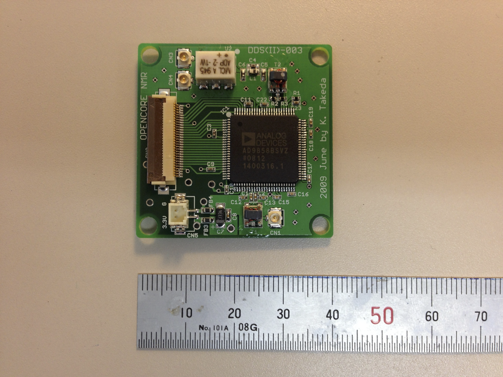

# Kinds of gates
29 Jan 2019 Kazuyuki Takeda
- - -
### Related Topics
- [gate definition](../gateDefinition/gateDefinition.md)
- [shaped pulse](../shapedPulse/shapedPulse.md)

### Introduction
Here I describe various kinds of *gate* defined in `*.gate` files. Detailed descriptions on *gate definition* is found [here](../gateDefinition/gateDefinition.md).

### Amplitude gate (kind=amplitude)
Suppose we have the following gate definition:
```
[ampWord]
channel = ...
bitlength = ...
kind = amplitude
ampWord_0 = ...
ampWord_1 = ...
...
```

Let me explain what happens when we use this gate in, say, the pulse command:
```
pulse(time; ampWord(value))
```
Here, `value` is a real number (or variable), which must be within a range from 0 to 100.0. The output value is determined according to

$$
  \mathrm{Round}\left( \frac{\mathrm{value}}{100.0} \times (2^{\mathrm{bitlength}}-1)\right)
$$

The precision of the floating-point number is arbitrary, but you have to take care of round-off by yourself. For example, in the case of `bitlength=10`, `value=10.0` would give us `102`, which corresponds to a binary expression of `0001100110`. Thus, the 1st, 2nd, 5th, and 6th bits are activated (Note that the least significant bit is defined to be the 0th bit). Similarly, `value=10.1` would result in `103`, so that the final output would be `0001100111`. However, `value=10.01` would make no difference from the result when `value=10.00`! At this moment, the compiler does not give you any warning messages regarding to round-off.

The amplitude gate may be useful when you want to specify the output level by percent of the maximum possible value. But if you do not like to care about the possible round-off errors, `kind=logic_vector`, described below, may be the choice.

### Logic-vector gates (kind=logic_vector)
```
[logicVectorWord]
channel = ...
bitlength = ...
kind = logic_vector
logicVectorWord_0 = ...
logicVectorWord_1 = ...
...
```
Let us say you want to implement
```
pulse(time; logicVectorWord(value))
```
Now, the value should be an integer number or variable ranging from $0$ to $2^{\mathrm{bitlength}}-1$.


### Logic gates (kind=logic)
This can be regarded as a special case of logic_vector with `bitlenth=1`. The gate definition looks like this:
```
[logicWord]
channel = ...
bitlength = 1
kind = logic
logicWord_0 = ...
```
Unlike other kinds of gate, the logic gate does not require argument(s), so that the usage is like the following:
```
pulse(time; logicWord)
```

Note the absence of the argument, i.e., parenthesized value, followed by `logicWord`. Since it carries only a single bit, the way of its usage is unambiguous; when it is used, the corresponding bit is activated, and vice versa.


### Integer gates (kind=integer)
This is a singed version of logic_vector. Its declaration and usage is quite similar to logic_vector:
```
[intWord]
channel = ...
bitlength = ...
kind = integer
intWord_0 = ...
intWord_1 = ...
...
```
An example of usage is:
```
pulse(time; intWord(value))
```
Now, `value` should be a signed integer value ranging from

$$
-2^{\mathrm{bitlength-1}}
$$
to
$$
2^{\mathrm{bitlength-1}}-1
$$
This may be used for, e.g., generating field-gradient pulses.


### Phase gates (kind=phase)
```
[phaseWord]
channel = ...
bitlength = ...
kind = phase
phaseWord_0 = ...
phaseWord_1 = ...
...
```
An example of usage is:
```
pulse(time; phaseWord(value))
```
This is used for rf phase control. The value should be given in *degrees* (not radians!). Any real number is acceptable, but periodicity is assumed. That is, `value=1.0`, `361.0`, `720.1`, `3600001.0`, `-359.0`, and so on, would all be equivalent. The value is brought within the range between 0 and 360, and the output result is then calculated according to
$$
  \mathrm{Round}\left( \frac{\mathrm{value}}{360.0} \times (2^{\mathrm{bitlength}}-1)\right)
$$

You should take care of possible round-off errors, just as in the case of the amplitude gate.


### RFIQ Gates (kind=rfiq)
By **IQ**, I mean **I**n-phase and **Q**uadrature components of radio-frequency (rf) signals. Sometimes you may want characterize rf signals by *complex* numbers, whereas, from hardware's viewpoint, it is straightforward to specify the amplitude and the phase of the signal. A signal with an amplitude $A$ and phase $\phi$ is characterized by a complex number with *in-phase* (real) and *quadrature* (imaginary) components $s_i,s_q$ being
$$
  s_i = A \cos\phi, \quad s_q = A \sin \phi
$$
Conversely, for a given set of the in-phase and quadrature components $s_i$ and $s_q$, the amplitude $A$ and the phase $\phi$ are represented as
$$
  A = \sqrt{s_i^2 + s_q^2}, \quad \phi=\tan^{-1}\left( \frac{s_q}{s_i} \right)
$$

With the RFIQ gate, you can link an amplitude gate and a phase gate. In `defaultGates.gate`, we have the following entries:
```
[f1iq]
kind = rfiq
channel = 1
amp = f1amp
phase = f1phase

[f2iq]
kind = rfiq
channel = 2
amp = f2amp
phase = f2phase

[f3iq]
kind = rfiq
channel = 3
amp = f3amp
phase = f3phase
```
Here, `f1iq`, representing the RFIQ gate for rf channel #1, is associated with the amplitude gate `f1amp` and the phase gate `f1phase`. In a pulse program, you can use it as follows:
```
pulse(pw; F1IQ(si,sq))
```
Then, the compiler interprets the command in such a way that the amplitude and the phase should be set at $\sqrt{s_i^2 + s_q^2}$ and $\tan^{-1}\left( s_q / s_i \right)$, respectively.

An example of applications of the RFIQ gate is found in a topic on [shaped pulses](../shapedPulse/shapedPulse.md).

### AD9858 Gates (kind=AD9858)
This is dedicated to control a direct digital synthesizer (DDS) board of the Opencore NMR spectrometer. It has a size of 40x40mm, and is equipped with a DDS chip AD9858 (Analog Devices). It is driven by a clock signal with a frequency of 1 GHz, and the frequency is controlled by the pulse programmer via a 0.5 mm pitch, 30 pin FPC cable. Roughly speaking, the maximum output frequency of a DDS is determined by ~0.4 times the clock frequency, which is ~400 MHz in the present case. But I have a feeling frequency generation up to ~420 MHz looks fine.


The AD9858 chip has a 2-bit register called “profile”. On each of the four (22=4) profiles, AD9858 can store separate output frequency, and later on, you can choose which is used (using a 2-bit logic_vector gate for profile selection). This function may be used to switch frequency from one value to another very rapidly.
In addition, AD9858 is capable of sweeping the frequency. I will describe how to do it later, but I must say that full control of this DDS board requires understanding the principle of its operation.

In the definition of the AD9858 gate, `bitlength` must be 16.
```
[AD9858Word]
channel = ...
bitlength = 16
kind = AD9858
AD9858Word_0 = ...
AD9858Word_1 = ...
...
AD9858Word_15 = ...
```
And the usage of this gate is
```
pulse(time; AD9858Word(profile; value))
```
or
```
pulse(time; AD9858Word(value))
```
In the former case, profile should be 0, 1, 2, or 3. In the latter case, profile=0 is assumed. That is, the latter, `pulse(time; AD9858Word(value))`, is equivalent to `pulse(time; AD9858Word(0; value))`.

##### Offset Frequency
We may want to make an offset in the output frequency. That is, we may need to set the actual frequency to be
```
value+offset (in MHz).
```
What is the point of setting the offset? Well, in the Opencore NMR spectrometer, and in many other applications of radio-frequency engineering, a signal at one frequency is often mixed with a signal at another. In the transmitter of the Opencore NMR spectrometer, the output signal of this DDS board is mixed with a phase-controlled signal with a frequency fixed at 180 MHz. Then, the resultant frequency f of the transmitting signal is either `f=value+180 MHz`, or `f=value-180 MHz`. The choice is up to you, depending on if you want to up-convert or down-convert the frequency.
If you use up-conversion, it would be convenient to set
```
transform F1Freq=#-180;
```
in the preamble of the pulse program. Then, if you want to generate a signal at, say, 300 MHz, at the final output port of the transmitter, you may write
```
pulse(time; AD9858Word(300.0))
```
The compiler automatically calculate the frequency of the DDS output signal for you to be
```
300-180=120 MHz
```
Similarly, if you want to perform down-conversion, you may write in the gate definition file as
```
transform F1Freq=#+180;
```
Again, if the frequency of interest is, e.g., 75 MHz, you can write a command
```
pulse(time; AD9858Word(75.0))
```
And the compiler interprets the DDS frequency to be
```
75+180=255 MHz
```
In this way, an intuitive and straightforward programming of the transmitting frequency is possible, once the offset entry of the gate definition file is specified appropriately.

Considering the maximum frequency of the DDS output signal (400~420 MHz), down-conversion is appropriate for the resultant frequency of up to ~220 MHz. The higher frequencies up to ~600 MHz can be covered with up-conversion.

##### Profile Selection (PS)
For Profile Selection (PS) of AD9858, we have to prepare a two-bit logic_vector gate in the gate definition, like:
```
[F1FreqPS]
caption = AD9858 Profile Select for channel 1
channel = 1
bitLength = 2
kind = logic_vector
F1FreqPS_0 = 47
F1FreqPS_1 = 46
```
In this example, we set the gate name to be `F1FreqPS`, and the PS0 and PS1 pins of AD9858 (for more detail, see the data sheet of AD9858) are physically connected to the 47th and 46th bits of the line output of the pulse programmer of channel 1. Abrupt frequency switching may be implemented by
```
pulse(time; F1FreqPS(0))
pulse(time; F1FreqPS(1))
pulse(time; F1FreqPS(2))
pulse(time; F1FreqPS(3))
```
Here, we assume that we have already set the profiles 0, 1, 2, and 3.

Note that argument “0” of a logic_vector gate is equivalent to doing nothing. This means that frequency set on the 0-th profile continues to be active, unless you use profile selection.
```
pulse(time; AD9858Word(value1))
pulse(time; ...)
pulse(time; ...)
pulse(time; AD9858Word(value2))
...
```
In the above example, the frequency at value1 set in the 1st line is kept until the 4th line, where another frequency value2 is set. This way of switching frequency is straightforward, but takes a time interval of the order of a hundred nanoseconds. Compared to this, frequency switching by profile selection is very fast.

Frequency sweep, which I believe to be another topic of great interest, will be described elsewhere.

[Back to Top](../../index.md)
