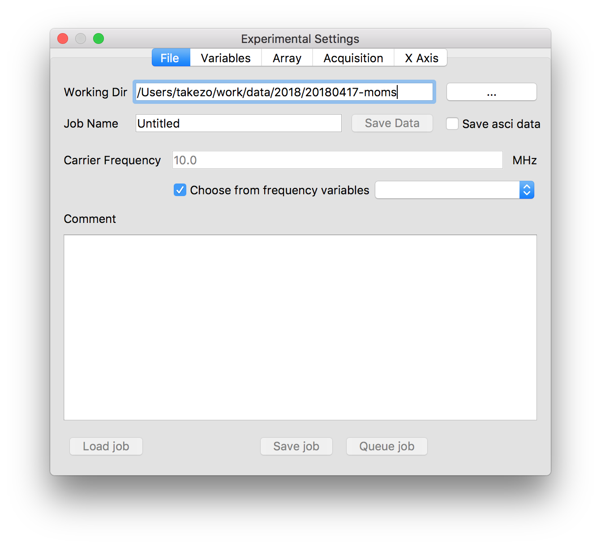
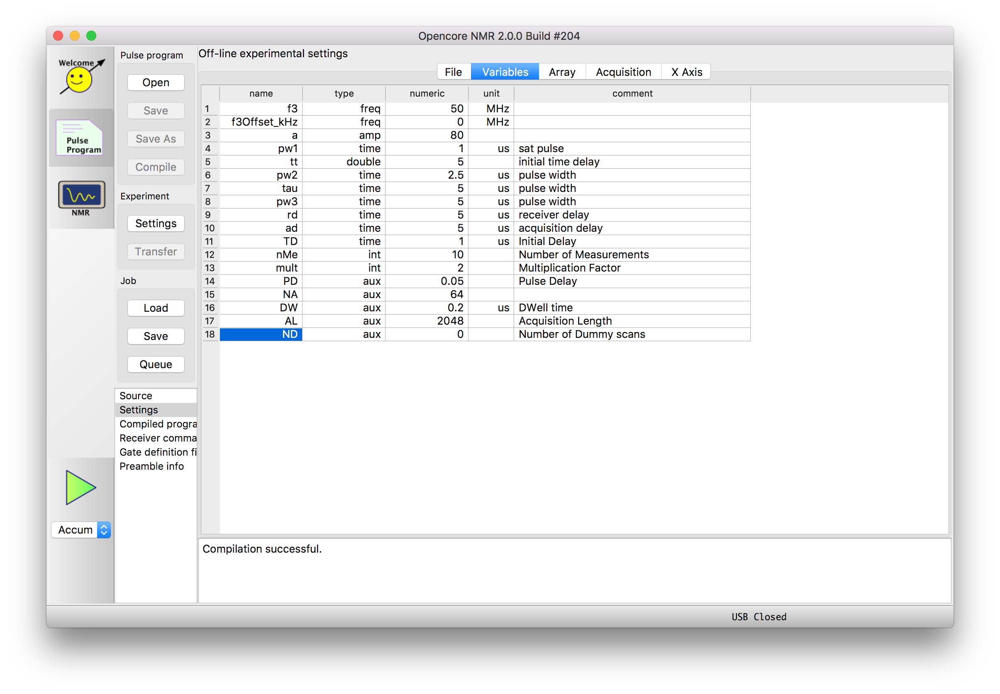

# _On-line_ experimental settings and _Off-line_ experimental settings

21 July 2018 Kazuyuki Takeda

## Introduction
On the _Experimental settings_ panel of the Opencore NMR console software, we set up the conditions and parameters for the experiments that we want to implement. For example, we specify the file name, modify variable values, arrange array experiments, and so on. In setting up such important experimental parameters, we should keep in mind there are two _separate_ experimental settings panels, namely, ***on-line*** and ***off-line*** experimental settings panels.

- The panel of _on-line_ experimental setting appears as an independent window.

- Whereas that of _off-resonance_ experimental setting is embedded in the main window of the software, and appears when you select the _pulse program_ button of the left column, and then select the "Settings" item in the listbox on the left.

## On-line experimental settings
 - To set up parameters, hardware connection between the computer and the spectrometer must have been established.
 - If you change the value of the variables, the modification is immediately transferred to the spectrometer.
 - During the experiment is running you cannot modify the parameter.
 - That is, if you want to change parameters/conditions, you need to stop the experiments.

## Off-line experimental settings
 - In the off-line experimental settings, we can set up the conditions/parameters irrespective of whether the connection between the computer and the spectrometer is established.
 - Importantly, _even if your computer is connected_ to the spectrometers, the changes made in the off-line experimental settings ***will not be*** transferred to the spectrometer, unless you click the "Transfer" button. And note that the transfer button is disable during the experiment is actually running.
 - What is great about the off-line experimental settings is that, even if the experiment is currently running, you can set up the parameters of the _next_ experiment.
 - In addition, you can set up and prepare experiments in advance to their implementation, even on computers that is not connected to the spectrometer.
 - All information set on the experimental settings panel will be stored in _a job file_, with a file extension of ".nmrjob".
 - Such **jobs** can either be queued (if the experiment is running) for the next experiment, or stored in a storage device for future usage.

 - - -
[Back](../../index.md)
 - - -
