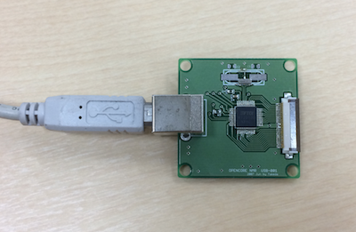
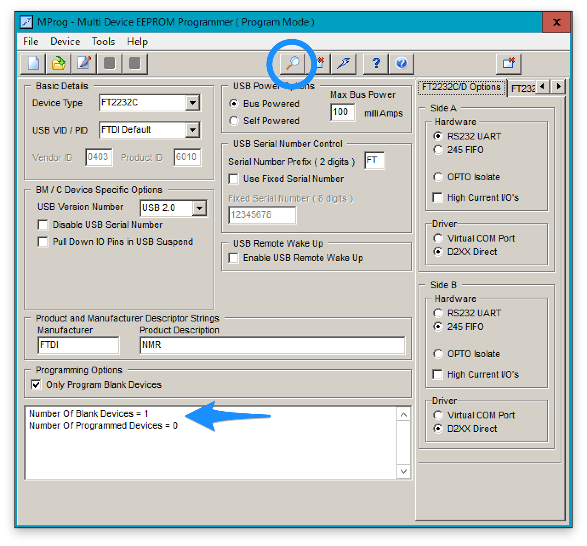

# Writing EPROM on USB board  
3 Sep 2018 Kazuyuki Takeda  

## EPROM configuration using MProg
- It seems only Windows can do this USB configuration procedure (I myself do this on a virtual Windows system running on Mac using VMWare Fusion). Nevertheless, **once the EPROM has been configured, you can use Mac and Linux as well!**
- Go to [FTDI's site](http://www.ftdichip.com/Support/Utilities.htm#MProg) and download **MProg** software.  
- Download [opencore-usb.ept (opencore usb configuration file)](opencore-usb.ept).  
- Connect the USB board of the Opencore NMR spectrometer.  

- Launch MProg.exe, connect the USB board, and click the magnifying glass icon.  
  
- If you connect this board for the first time, you should get a message saying that the number of blank devices is 1 and that of programmed devices is 0.
- Open the opencore-usb.ept. Then, parameters should have been set as shown in the figure.

- Finally, click the lightning-bolt icon to write these parameters in the EPROM on the board.  
  
- If you get a message like "Programmed Serial Number: ...", this board is ready for use!

