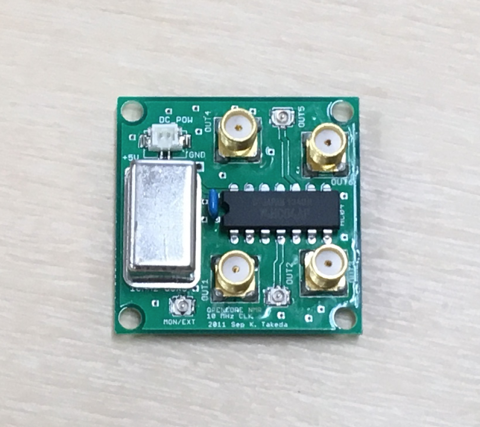
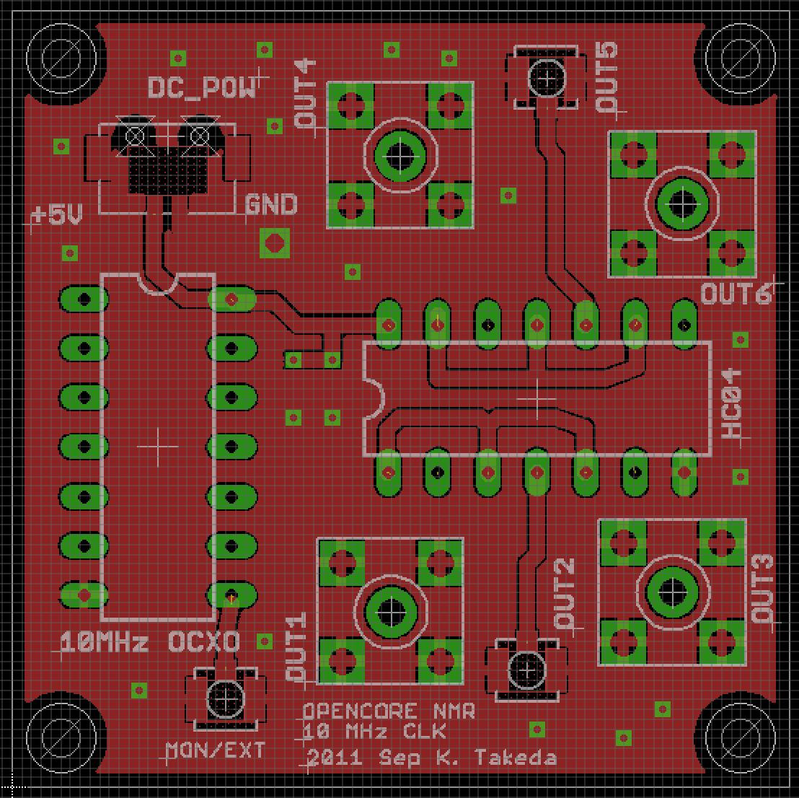
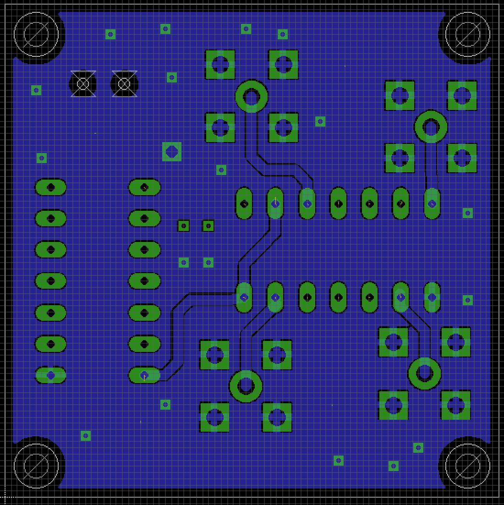

# 10 MHz Clock

14 Mar 2019 Kazuyuki Takeda

[Back to Home](../../index.md)  
- - -

This board generates a clock signal at 10 MHz. On the board, the clock signal is fan-out into several ports. The 10 MHz clock signal is required for the [mother board](../motherBoard/motherMoard.md). as well as 1 GHz clock module, to be described in due time.

- - -

### Board design

- The board was designed on EAGLE 6.2.0 Professional  
- There are **2 layers**, the top and the bottom layers.

##### EAGLE schematic and board files
- Board: [10MCLK02.brd](data/10MCLK02.brd)  

##### Gerber files
- [10MCLK02.cmp](data/gerber/10MCLK02.cmp)  (Component side pattern)
- [10MCLK02.plc](data/gerber/10MCLK02.plc)  (Component side silkscreen)
- [10MCLK02.sol](data/gerber/10MCLK02.sol)  (Solder side pattern)
- [10MCLK02.stc](data/gerber/10MCLK02.stc)  (Component side solder resist)
- [10MCLK02.sts](data/gerber/10MCLK02.sts)  (Solder side solder resist)
- [10MCLK02.out](data/gerber/10MCLK02.out)  (outline)
- [10MCLK02.dri](data/gerber/10MCLK02.dri)  (drill list)
- [10MCLK02.drd](data/gerber/10MCLK02.drd)  (drill data)

**Note**: The *component side* mean the top (1st) layer, while the *solder side* does the bottom layer.

##### Component side (1st layer)

##### Solder side (bottom layer)

### Parts List (TODO)

Part	| Value | 	Device	| Package | Description
---|---|---|---|---
CN	| 	    | U.FL-R-SMT | | (HIROSE)		
CN	| 	    | U.FL-R-SMT | | (HIROSE)		
CN	| 	    | U.FL-R-SMT | | (HIROSE)		
CN	 | 	    | DF13-2P-1.25V | | (HIROSE) 		
CN | |  SMA Straight PCB Socket | | 5-1814832-1 (TE Connectivity)
CN | |  SMA Straight PCB Socket | | 5-1814832-1 (TE Connectivity)
CN | |  SMA Straight PCB Socket | | 5-1814832-1 (TE Connectivity)
CN | |  SMA Straight PCB Socket | | 5-1814832-1 (TE Connectivity)
OCXO   |  | MOFH5200C-10.000 |  | (MMD)
IC  |  | HC04 |
- - -
[Back to Home](../../index.md)  
