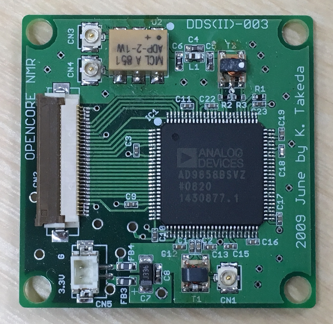
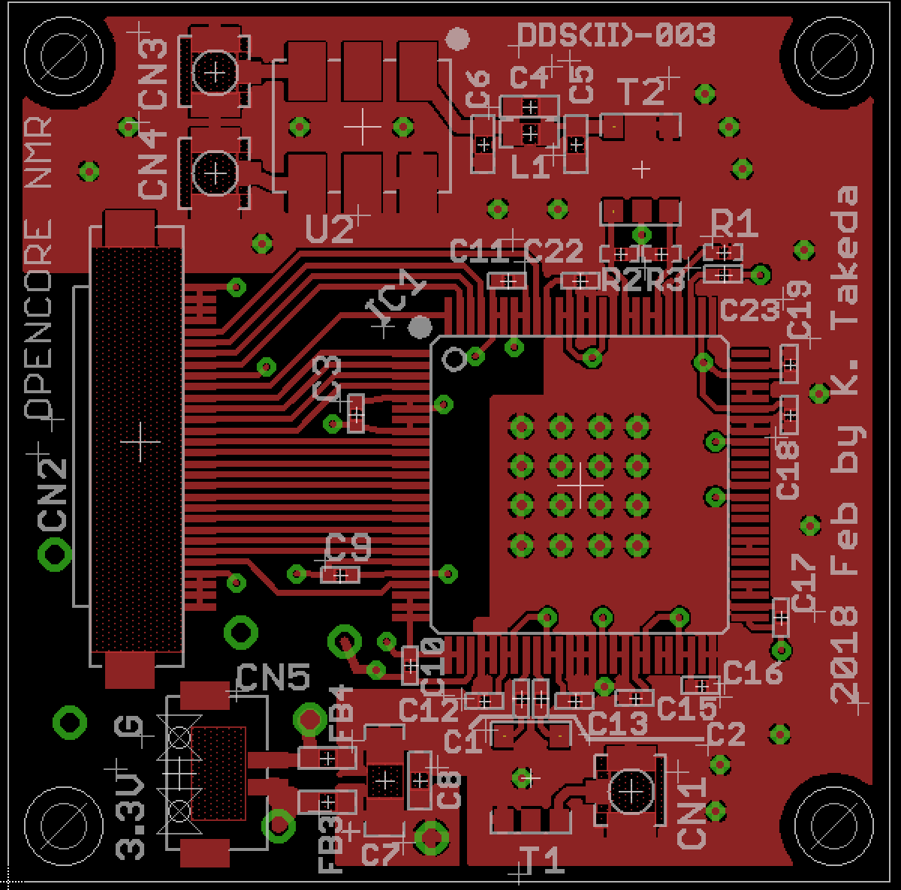
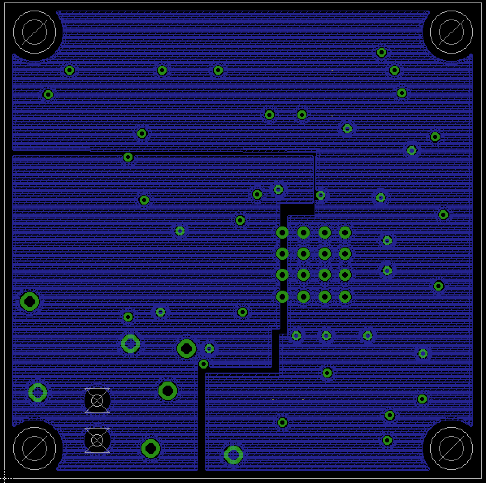
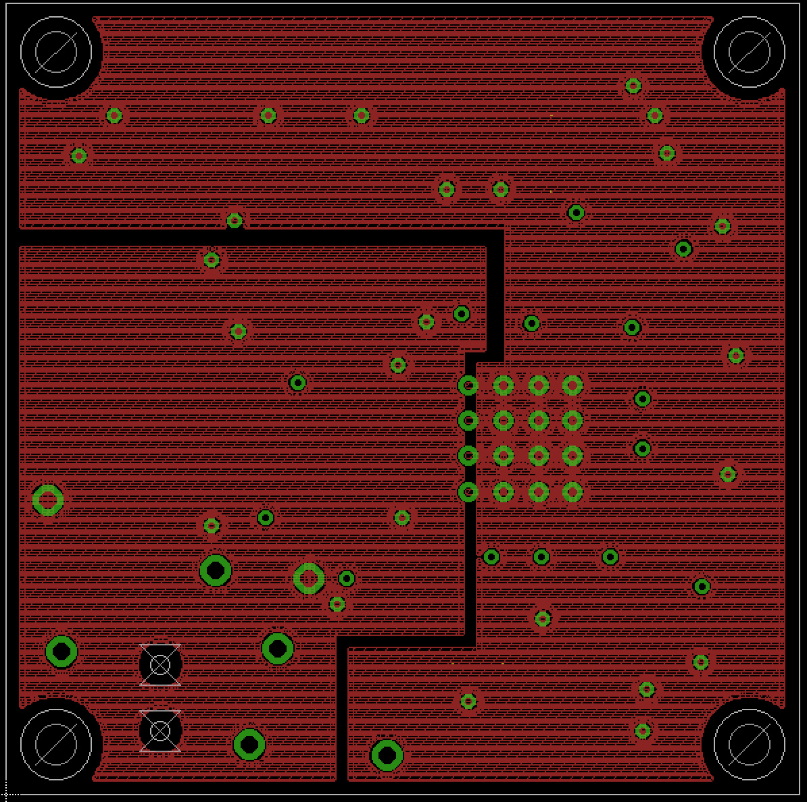
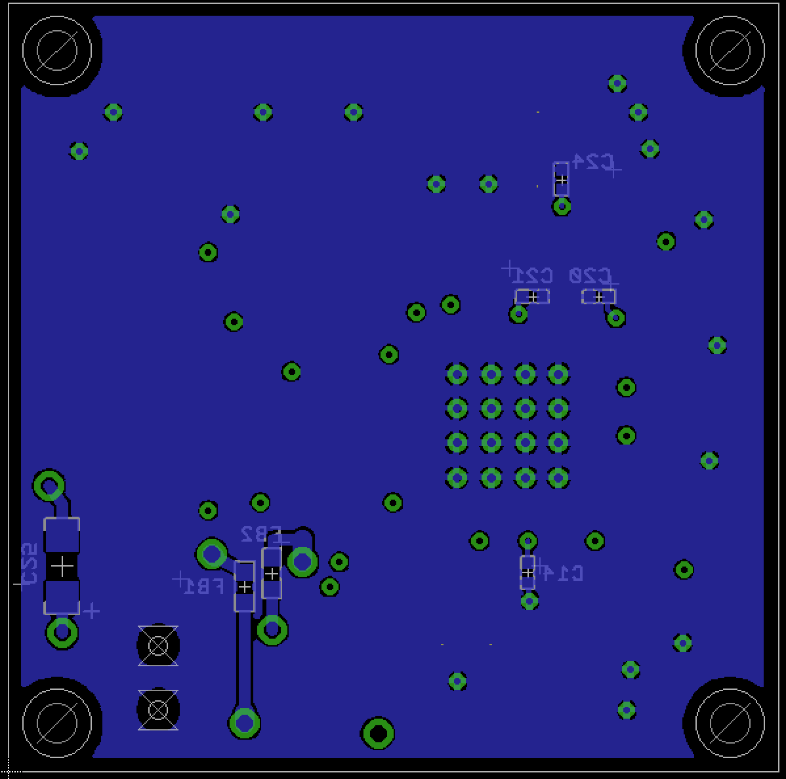

# DDS2

9 Mar 2019 Revised by Kazuyuki Takeda
2 Mar 2019 Kazuyuki Takeda

[Back to Home](../../index.md)  
- - -

This board serves for a direct digital synthesizer (DDS). Each rf channel of the Opencore NMR spectrometer is equipped with two separate DDS. The first DDS is implemented on the [mother board](../motherBoard/motherMoard.md). Here, we described the *second* one, which we call DDS2.

- - -

### Board design

- The board was designed on EAGLE 6.2.0 Professional  
- There are **4 layers**. That is, in addition to the top and bottom layers, the board has two inner layers.  

##### EAGLE schematic and board files
- Schematic: [DDS2-03.sch](data/DDS2-03.sch)  
- Board: [DDS2-03.brd](data/DDS22-03.brd)  

##### Gerber files
- [DDS2-03.cmp](data/gerber/DDS2-03.cmp)  (Component side pattern)
- [DDS2-03.plc](data/gerber/DDS2-03.plc)  (Component side silkscreen)
- [DDS2-03.sol](data/gerber/DDS2-03.sol)  (Solder side pattern)
- [DDS2-03.stc](data/gerber/DDS2-03.stc)  (Component side solder resist)
- [DDS2-03.sts](data/gerber/DDS2-03.sts)  (Solder side solder resist)
- [DDS2-03.pls](data/gerber/DDS2-03.pls)  (Solder side silkscreen)
- [DDS2-03.2l ](data/gerber/DDS2-03.2l )  (2nd (inner) layer pattern)
- [DDS2-03.3l ](data/gerber/DDS2-03.3l )  (3rd (inner) layer pattern)
- [DDS2-03.out](data/gerber/DDS2-03.out)  (outline)
- [DDS2-03.dri](data/gerber/DDS2-03.dri)  (drill list)
- [DDS2-03.drd](data/gerber/DDS2-03.drd)  (drill data)

**Note**: The *component side* mean the top (1st) layer, while the *solder side* does the bottom layer.

##### Component side (1st layer)

##### 2nd (inner) layer

##### 3rd (inner) layer

##### Solder side (bottom layer)

### Parts List

Part	| Value | 	Device	| Package | Description
---|---|---|---|---
C1	| 1000p	| C	| 1005
C2	| 1000p	| C	| 1005
C3	| 0.1u	| C	| 1005
C4	| 6p	  | C	| 1608
C5	| 12p	  | C	| 1608
C6	| 12p	  | C	| 1608
C7	| 33u	  | C	| 3216 (polar) | tantalum
C8	| 0.01u	| C	| 1608
C9	| 0.1u	| C	| 1005
C10	| 0.1u	| C	| 1005
C11	| 0.1u	| C	| 1005
C12	| 0.01u	| C	| 1005
C13	| 0.01u	| C	| 1005
C14	| 0.01u	| C	| 1005
C15	| 0.01u	| C	| 1005
C16	| 0.01u	| C	| 1005
C17	| 0.01u	| C	| 1005
C18	| 0.01u	| C	| 1005
C19	| 0.01u	| C	| 1005
C20	| 0.01u	| C	| 1005
C21	| 0.01u	| C	| 1005
C22	| 0.01u	| C	| 1005
C23	| 0.1u	| C	| 1005
C24	| 0.01u	| C	| 1005
C25	| 33u	  | C	| 3216 (polar) | tantalum
CN1	| 	    | U.FL-R-SMT | | (HIROSE)		
CN2	| 	    | FH12-30S-0.5SH | | (HIROSE)		0.5mm pitch FPC connector
CN3	| 	    | U.FL-R-SMT | | (HIROSE)		
CN4	| 	    | U.FL-R-SMT | | (HIROSE)		
CN5	| 	    | DF13-2P-1.25V | | (HIROSE)		
FB1  |  30 Ohm @ 100 MHz   |  MPZ1608S300A   | 1608           | Ferrite bead (TDK)
FB2  |  30 Ohm @ 100 MHz   |  MPZ1608S300A   | 1608           | Ferrite bead (TDK)
FB3  |  30 Ohm @ 100 MHz   |  MPZ1608S300A   | 1608           | Ferrite bead (TDK)
FB4  |  30 Ohm @ 100 MHz   |  MPZ1608S300A   | 1608           | Ferrite bead (TDK)
U1	| 	    | AD9858 | | (Analog Divices)		DDS chip
L1	| 12nH	| L | 1608
R1	| 2k	  | R | 1005
R2	| 27	  | R | 1005
R3	| 27	  | R | 1005
T1	| 	    | TC1-1-13M+ | | (Mini Circuits)	AT224	RF transformer
T2	| 	    | TC1-1T+ |  |(Mini Circuits)	AT224	RF transformer
U2	| 	    | ADP-2-1W | | (Mini Circuits)		RF splitter

- - -
[Back to Home](../../index.md)  
