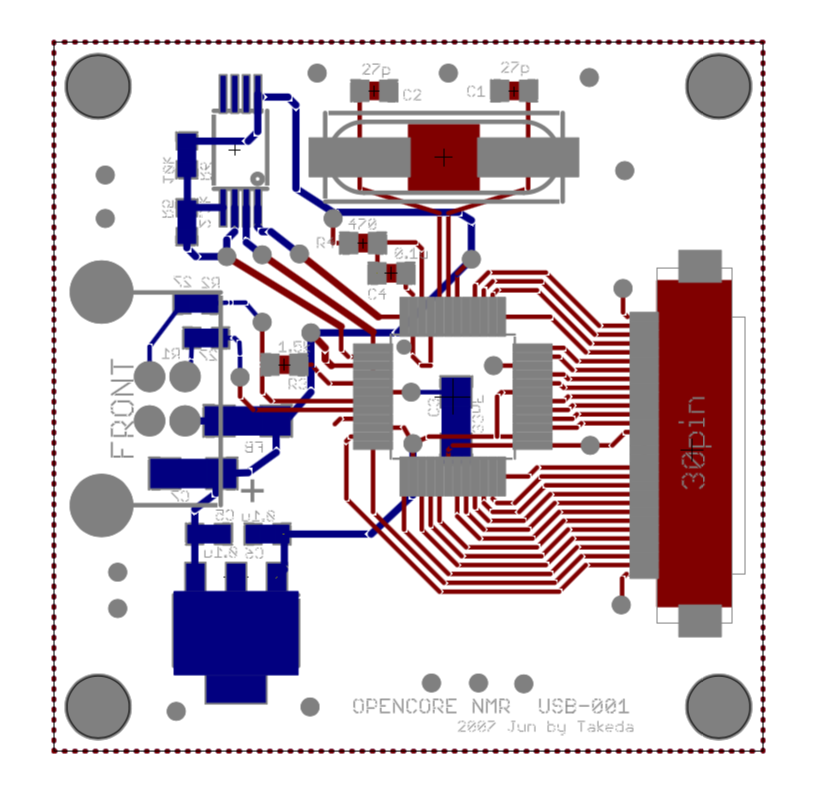

# USB board

5 Mar 2019 Kazuyuki Takeda

[Back to Home](../../index.md)  

- - -
  

This is a 40x40 mm board equipped with FT2232, a dual-line USB driver by [FTDI](https://www.ftdichip.com) inc. This enables apparent simultaneous two-channel data communication between the OPENCORE NMR spectrometer and the console software installed on a personal computer through a single USB cable. In the current architecture of the OPENCORE NMR, the one channel (channel A) is used in the UART 232 mode for sending/receiving the commands/responses to/from the PPG interface core module built inside the FPGA chip, the other (channel B) for transferring the NMR signals from the RCVR core module to the personal computer in the 245 FIFO mode.

Before using, the mode of operation must be configured to the EPROM on the board using the [MProg](https://www.ftdichip.com/Support/Utilities.htm#MProg) software (FTDI).
- [A document on EPROM configuration](https://github.com/opencorenmr/opencorenmr-docs/blob/master/blog/usb_eprom/mprog.md)  

Also, the [D2XX driver](https://www.ftdichip.com/Drivers/D2XX.htm), which is available from FTDI, has to be installed.  

### Board design

- The board was designed on EAGLE 6.2.0 Professional  
- There are **2 layers**, namely, the top (component) and bottom (solder) layers.

##### EAGLE schematic and board files
- Schematic: [USB.sch](data/USB.sch)  
- Board: [USB.brd](data/USB.brd)  

##### Gerber files

- [USB.cmp](data/gerber/USB.cmp) (Component side pattern)
- [USB.plc](data/gerber/USB.plc)（Component side silkscreen)
- [USB.sol](data/gerber/USB.sol)（Solder side pattern）
- [USB.stc](data/gerber/USB.stc)（Component side solder resist）
- [USB.sts](data/gerber/USB.sts)（Solder side solder resist）
- [USB.pls](data/gerber/USB.pls)（Solder side silkscreen）
- [USB.out](data/gerber/USB.out)（outline）
- [USB.dri](data/gerber/USB.dri) (drill list）
- [USB.drd](data/gerber/USB.drd)（drill data）

**Note**: The *component side* mean the top (1st) layer, while the *solder side* does the bottom layer.

### Parts List

Part  | Value  | Device  | Package  | Description
--|---|---|---|--
C1	| *27p | 	C |	1608 |
C2	| *27p | 	C |	1608 |
C3	| 33nF | 	C |	3216 |
C4	| 0.1u | 	C |	1608 |
C5	| 0.1u | 	C |	1608 |
C6	| 0.1u | 	C |	1608 |
C7	| 10u  | 	C |	3216 (polar) | tantalum
CN1	|  | FH12-30S-0.5SH 	| | 	0.5 mm pitch FPC connector (HIROSE)
FB  |  30 Ohm @ 100 MHz   |  MPZ1608S300A   | 1608           | Ferrite bead (TDK)
R1	| 27	  | R	| 1608	|
R2	| 27	  | R	| 1608	|
R3	| 1.5k	| R	| 1608	|
R4	| 470	  | R	| 1608	|
R5	| 2.2k	| R	| 1608	|
R6	| 10k	  | R	| 1608	|
U1	|  | FT2232D	|	| Dual USB UART/FIFO I.C. (FTDI)
U2	|  | 67068-704J  |	|	USB connector (MOLEX)
U3	|  | **AT93C46-10TU-2.7	|  Thin Shrink Small Outline Package (TSSOP) |	Serial EPROM (ATMEL)
U4	|  | LM2937IMP-3.3	| SOT-223	| Voltage regulator
Y1	| 6 MHz	| HC49/4H SMX	| |	6 MHz crystal

*Note: The proper value for C1 and C2 depends on the crystal oscillator. Check the datasheet of the 6 MHz crystal that you use.

**Note: End of production. There should be alternatives. According to the datasheet of FT2232D, EEPROMs with a 16-bit wide configuration are required. And the EEPROM must be operational at a 1 MHz clock rate with a supply voltage between 4.35V and 5.25V.

- - -
[Back to Home](../../index.md)  
