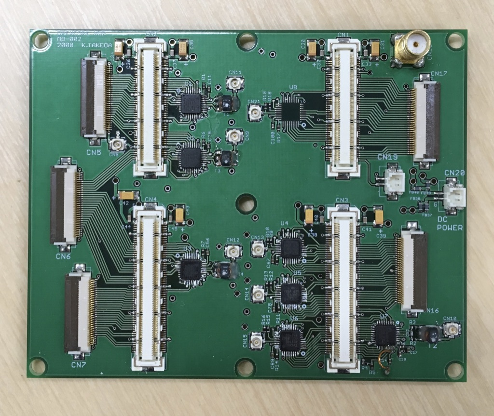
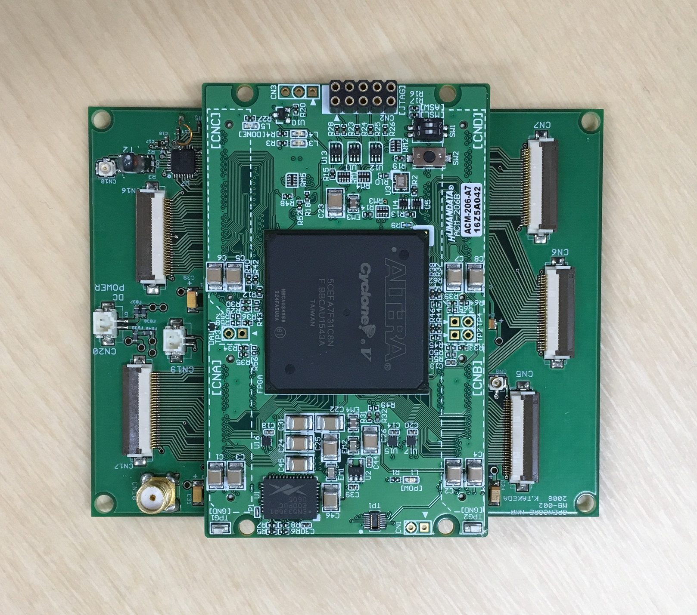
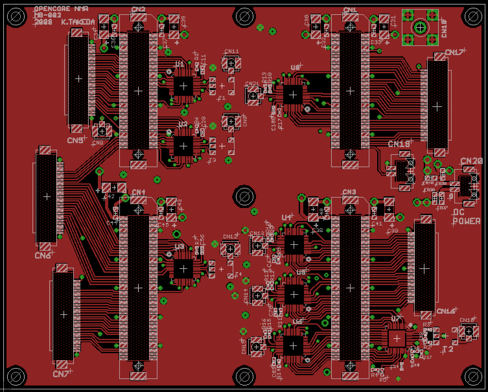
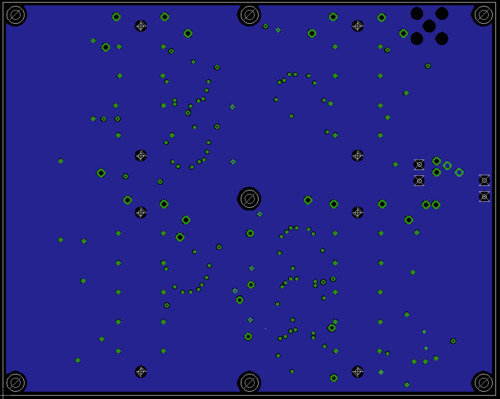
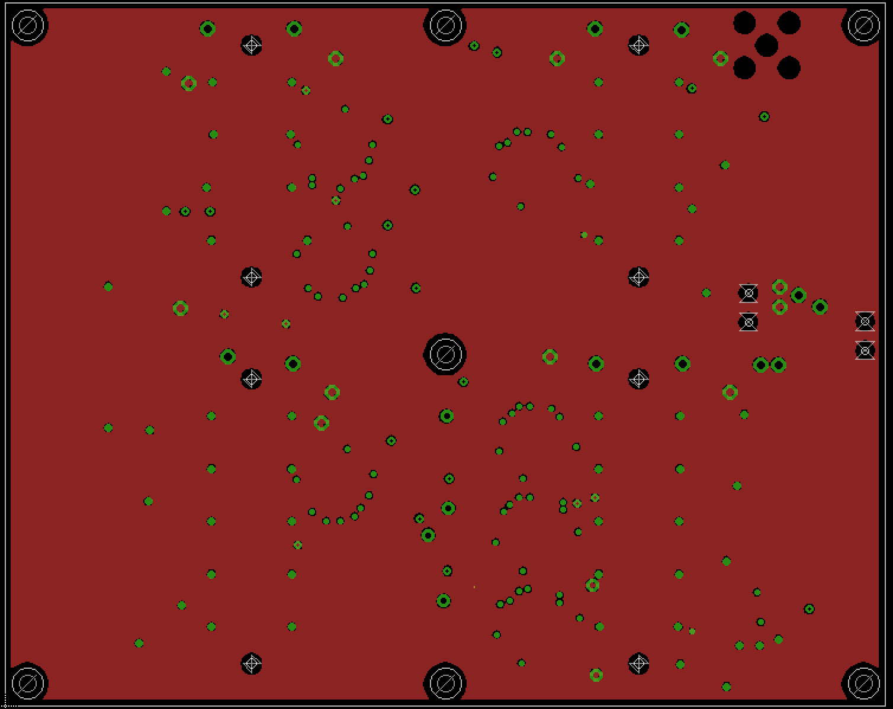
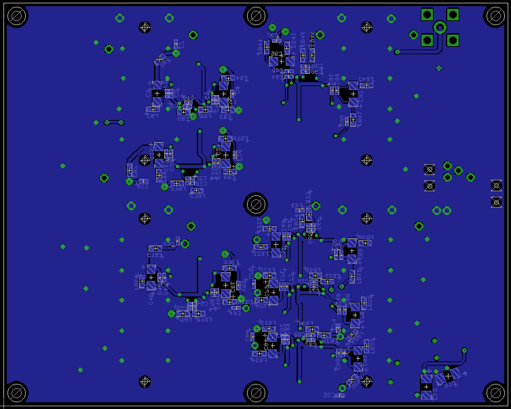

# Mother board

23 Feb 2019 Kazuyuki Takeda

[Back to Home](../../index.md)  
- - -

This board, called the *mother board*, is to be docked by either of the following commercial FPGA breadboards:
- [ACM-202-80C8](https://www2.hdl.co.jp/en/altera-series1/cycloneiii/acm-202-ql.html)  (HuMANDATA LTD.)  
- [ACM-206-A7](https://www2.hdl.co.jp/en/altera-series1/cyclonev/acm-206-ql.html) (HuMANDATA LTD.)  

The photo just below shows the *docked* board:

- - -

### Board design

- The board was designed on EAGLE 6.2.0 Professional  
- There are **4 layers**. That is, in addition to the top and bottom layers, the board has two inner layers.  

##### EAGLE schematic and board files
- Schematic: [mother-002.sch](data/mother-002.sch)  
- Board: [mother-002.brd](data/mother-002.brd)  

##### Gerber files

- [mother-002.cmp](data/gerber/mother-002.cmp) (Component side pattern)
- [mother-002.plc](data/gerber/mother-002.plc)（Component side silkscreen)
- [mother-002.sol](data/gerber/mother-002.sol)（Solder side pattern）
- [mother-002.stc](data/gerber/mother-002.stc)（Component side solder resist）
- [mother-002.sts](data/gerber/mother-002.sts)（Solder side solder resist）
- [mother-002.pls](data/gerber/mother-002.pls)（Solder side silkscreen）
- [mother-002.2l](data/gerber/mother-002.2l)（2nd (inner) layer pattern）
- [mother-002.3l](data/gerber/mother-002.3l)（3rd (inner) layer pattern）
- [mother-002.out](data/gerber/mother-002.out)（outline）
- [mother-002.dri](data/gerber/mother-002.dri) (drill list）
- [mother-002.drd](data/gerber/mother-002.drd)（drill data）

**Note**: The *component side* mean the top (1st) layer, while the *solder side* does the bottom layer.

##### Component side (1st layer)

##### 2nd (inner) layer

##### 3rd (inner) layer

##### Solder side (bottom layer)

### Parts List

Part  | Value  | Device  | Package  | Description
--|---|---|---|--
C1   |  0.1u           |  C1005            | 1005           |    
C2   |  1000p          |  C1005            | 1005           |    
C3   |  33u            |  C_POLAR3216      | 3216_POLAR     |    
C4   |  0.1u           |  C1005            | 1005           |    
C5   |  1000p          |  C1005            | 1005           |    
C6   |  33u            |  C_POLAR3216      | 3216_POLAR     |    
C7   |  0.1u           |  C1005            | 1005           |    
C8   |  0.1u           |  C1005            | 1005           |    
C9   |  1000p          |  C1005            | 1005           |    
C10  |  0.1u           |  C1005            | 1005           |    
C11  |  0.1u           |  C1005            | 1005           |    
C12  |  20p            |  C1005            | 1005           |    
C13  |  10uF           |  C_POLAR          | 3216_POLAR     |    
C14  |  0.1uF          |  C1005            | 1005           |    
C15  |  10uF           |  C_POLAR          | 3216_POLAR     |    
C16  |  0.1u           |  C1005            | 1005           |    
C17  |  0.1u           |  C1005            | 1005           |    
C18  |  0.1u           |  C1005            | 1005           |    
C19  |  0.1u           |  C1005            | 1005           |    
C20  |  1000p          |  C1005            | 1005           |    
C21  |  33u            |  C_POLAR3216      | 3216_POLAR     |    
C22  |  0.1u           |  C1005            | 1005           |    
C23  |  1000p          |  C1005            | 1005           |    
C24  |  33u            |  C_POLAR3216      | 3216_POLAR     |    
C25  |  0.1u           |  C1005            | 1005           |    
C26  |  0.1u           |  C1005            | 1005           |    
C27  |  1000p          |  C1005            | 1005           |    
C28  |  0.1u           |  C1005            | 1005           |    
C29  |  0.1u           |  C1005            | 1005           |    
C30  |  33u            |  C_POLAR          | 3216_POLAR     |    
C31  |  33u            |  C_POLAR          | 3216_POLAR     |    
C32  |  0.01u          |  C1608            | 1608           |    
C33  |  0.01u          |  C1608            | 1608           |    
C34  |  33u            |  C_POLAR          | 3216_POLAR     |    
C35  |  33u            |  C_POLAR          | 3216_POLAR     |    
C36  |  0.01u          |  C1608            | 1608           |    
C37  |  0.01u          |  C1608            | 1608           |    
C38  |  33u            |  C_POLAR          | 3216_POLAR     |    
C39  |  33u            |  C_POLAR          | 3216_POLAR     |    
C40  |  0.01u          |  C1608            | 1608           |    
C41  |  0.01u          |  C1608            | 1608           |    
C42  |  33u            |  C_POLAR          | 3216_POLAR     |    
C43  |  33u            |  C_POLAR          | 3216_POLAR     |    
C44  |  0.01u          |  C1608            | 1608           |    
C45  |  0.01u          |  C1608            | 1608           |    
C46  |  0.1u           |  C1005            | 1005           |    
C47  |  1000p          |  C1005            | 1005           |    
C48  |  33u            |  C_POLAR3216      | 3216_POLAR     |    
C49  |  0.1u           |  C1005            | 1005           |    
C50  |  1000p          |  C1005            | 1005           |    
C51  |  33u            |  C_POLAR3216      | 3216_POLAR     |    
C52  |  0.1u           |  C1005            | 1005           |    
C53  |  0.1u           |  C1005            | 1005           |    
C54  |  1000p          |  C1005            | 1005           |    
C55  |  0.1u           |  C1005            | 1005           |    
C56  |  0.1u           |  C1005            | 1005           |    
C57  |  0.1u           |  C1005            | 1005           |    
C58  |  1000p          |  C1005            | 1005           |    
C59  |  33u            |  C_POLAR3216      | 3216_POLAR     |    
C60  |  0.1u           |  C1005            | 1005           |    
C61  |  1000p          |  C1005            | 1005           |    
C62  |  33u            |  C_POLAR3216      | 3216_POLAR     |    
C63  |  0.1u           |  C1005            | 1005           |    
C64  |  0.1u           |  C1005            | 1005           |    
C65  |  1000p          |  C1005            | 1005           |    
C66  |  0.1u           |  C1005            | 1005           |    
C67  |  0.1u           |  C1005            | 1005           |    
C68  |  0.1u           |  C1005            | 1005           |    
C69  |  1000p          |  C1005            | 1005           |    
C70  |  33u            |  C_POLAR3216      | 3216_POLAR     |    
C71  |  0.1u           |  C1005            | 1005           |    
C72  |  1000p          |  C1005            | 1005           |    
C73  |  33u            |  C_POLAR3216      | 3216_POLAR     |    
C74  |  0.1u           |  C1005            | 1005           |    
C75  |  0.1u           |  C1005            | 1005           |    
C76  |  1000p          |  C1005            | 1005           |    
C77  |  0.1u           |  C1005            | 1005           |    
C78  |  0.1u           |  C1005            | 1005           |    
C79  |  0.1u           |  C1005            | 1005           |    
C80  |  1000p          |  C1005            | 1005           |    
C81  |  33u            |  C_POLAR3216      | 3216_POLAR     |    
C82  |  0.1u           |  C1005            | 1005           |    
C83  |  1000p          |  C1005            | 1005           |    
C84  |  33u            |  C_POLAR3216      | 3216_POLAR     |    
C85  |  0.1u           |  C1005            | 1005           |    
C86  |  0.1u           |  C1005            | 1005           |    
C87  |  1000p          |  C1005            | 1005           |    
C88  |  0.1u           |  C1005            | 1005           |    
C89  |  0.1u           |  C1005            | 1005           |    
C90  |  0.1u           |  C1005            | 1005           |    
C91  |  1000p          |  C1005            | 1005           |    
C92  |  33u            |  C_POLAR3216      | 3216_POLAR     |    
C93  |  0.1u           |  C1005            | 1005           |    
C94  |  1000p          |  C1005            | 1005           |    
C95  |  33u            |  C_POLAR3216      | 3216_POLAR     |    
C96  |  0.1u           |  C1005            | 1005           |    
C97  |  0.1u           |  C1005            | 1005           |    
C98  |  1000p          |  C1005            | 1005           |    
C99  |  0.1u           |  C1005            | 1005           |    
C100 |  0.1u           |  C1005            | 1005           |    
CN1  |  |  FX10A-80S/8-SV   |              |   HIROSE
CN2  |  |  FX10A-80S/8-SV   |              |   HIROSE
CN3  |  |  FX10A-100S/10-SV |              |   HIROSE
CN4  |  |  FX10A-100S/10-SV |              |   HIROSE
CN5  |  |  FH12-30S-0.5SH   | FPC_30         | HIROSE   
CN6  |  |  FH12-30S-0.5SH   | FPC_30         | HIROSE   
CN7  |  |  FH12-30S-0.5SH   | FPC_30         | HIROSE   
CN8  |  |  U.FL-R-SMT       | U.FL-R-SMT     | HIROSE   
CN9  |  |  U.FL-R-SMT       | U.FL-R-SMT     | HIROSE   
CN10 |  |  U.FL-R-SMT       | U.FL-R-SMT     | HIROSE   
CN11 |  |  U.FL-R-SMT       | U.FL-R-SMT     | HIROSE   
CN12 |  |  U.FL-R-SMT       | U.FL-R-SMT     | HIROSE   
CN13 |  |  U.FL-R-SMT       | U.FL-R-SMT     | HIROSE   
CN14 |  |  U.FL-R-SMT       | U.FL-R-SMT     | HIROSE   
CN15 |  |  U.FL-R-SMT       | U.FL-R-SMT     | HIROSE   
CN16 |  |  FH12-30S-0.5SH   | FPC_30         | HIROSE   
CN17 |  |  FH12-30S-0.5SH   | FPC_30         | HIROSE   
CN18 |  |      | SMA_STRAIGHT   |             
CN19 |    |  DF13-2P-1.25V    | DF13-2P-12.5V  | HIROSE    
CN20 |    |  DF13-2P-1.25V    | DF13-2P-12.5V  | HIROSE    
CN21 |    |  U.FL-R-SMT       | U.FL-R-SMT     | HIROSE    
FB1  |  30 Ohm @ 100 MHz   |  MPZ1608S300A   | 1608           | Ferrite bead (TDK)
FB2  |  30 Ohm @ 100 MHz   |  MPZ1608S300A   | 1608           | Ferrite bead (TDK)
FB3  |  30 Ohm @ 100 MHz   |  MPZ1608S300A   | 1608           | Ferrite bead (TDK)
FB4  |  30 Ohm @ 100 MHz   |  MPZ1608S300A   | 1608           | Ferrite bead (TDK)
FB5  |  30 Ohm @ 100 MHz   |  MPZ1608S300A   | 1608           | Ferrite bead (TDK)
FB6  |  30 Ohm @ 100 MHz   |  MPZ1608S300A   | 1608           | Ferrite bead (TDK)
FB7  |  30 Ohm @ 100 MHz   |  MPZ1608S300A   | 1608           | Ferrite bead (TDK)
FB8  |  30 Ohm @ 100 MHz   |  MPZ1608S300A   | 1608           | Ferrite bead (TDK)
FB9  |  30 Ohm @ 100 MHz   |  MPZ1608S300A   | 1608           | Ferrite bead (TDK)
FB10 |  30 Ohm @ 100 MHz   |  MPZ1608S300A   | 1608           | Ferrite bead (TDK)
FB11 |  30 Ohm @ 100 MHz   |  MPZ1608S300A   | 1608           | Ferrite bead (TDK)
FB12 |  30 Ohm @ 100 MHz   |  MPZ1608S300A   | 1608           | Ferrite bead (TDK)
FB13 |  30 Ohm @ 100 MHz   |  MPZ1608S300A   | 1608           | Ferrite bead (TDK)
FB14 |  30 Ohm @ 100 MHz   |  MPZ1608S300A   | 1608           | Ferrite bead (TDK)
FB15 |  30 Ohm @ 100 MHz   |  MPZ1608S300A   | 1608           | Ferrite bead (TDK)
FB16 |  30 Ohm @ 100 MHz   |  MPZ1608S300A   | 1608           | Ferrite bead (TDK)
FB17 |  30 Ohm @ 100 MHz   |  MPZ1608S300A   | 1608           | Ferrite bead (TDK)
FB18 |  30 Ohm @ 100 MHz   |  MPZ1608S300A   | 1608           | Ferrite bead (TDK)
FB19 |  30 Ohm @ 100 MHz   |  MPZ1608S300A   | 1608           | Ferrite bead (TDK)
FB20 |  30 Ohm @ 100 MHz   |  MPZ1608S300A   | 1608           | Ferrite bead (TDK)
FB21 |  30 Ohm @ 100 MHz   |  MPZ1608S300A   | 1608           | Ferrite bead (TDK)
FB22 |  30 Ohm @ 100 MHz   |  MPZ1608S300A   | 1608           | Ferrite bead (TDK)
FB23 |  30 Ohm @ 100 MHz   |  MPZ1608S300A   | 1608           | Ferrite bead (TDK)
FB24 |  30 Ohm @ 100 MHz   |  MPZ1608S300A   | 1608           | Ferrite bead (TDK)
FB25 |  30 Ohm @ 100 MHz   |  MPZ1608S300A   | 1608           | Ferrite bead (TDK)
FB26 |  30 Ohm @ 100 MHz   |  MPZ1608S300A   | 1608           | Ferrite bead (TDK)
FB27 |  30 Ohm @ 100 MHz   |  MPZ1608S300A   | 1608           | Ferrite bead (TDK)
FB28 |  30 Ohm @ 100 MHz   |  MPZ1608S300A   | 1608           | Ferrite bead (TDK)
FB29 |  30 Ohm @ 100 MHz   |  MPZ1608S300A   | 1608           | Ferrite bead (TDK)
FB30 |  30 Ohm @ 100 MHz   |  MPZ1608S300A   | 1608           | Ferrite bead (TDK)
FB31 |  30 Ohm @ 100 MHz   |  MPZ1608S300A   | 1608           | Ferrite bead (TDK)
FB32 |  30 Ohm @ 100 MHz   |  MPZ1608S300A   | 1608           | Ferrite bead (TDK)
FB33 |  30 Ohm @ 100 MHz   |  MPZ1608S300A   | 1608           | Ferrite bead (TDK)
FB34 |  30 Ohm @ 100 MHz   |  MPZ1608S300A   | 1608           | Ferrite bead (TDK)
FB35 |  30 Ohm @ 100 MHz   |  MPZ1608S300A   | 1608           | Ferrite bead (TDK)
FB36 |  30 Ohm @ 100 MHz   |  MPZ1608S300A   | 1608           | Ferrite bead (TDK)
FB37 |  30 Ohm @ 100 MHz   |  MPZ1608S300A   | 1608           | Ferrite bead (TDK)
FB38 |  30 Ohm @ 100 MHz   |  MPZ1608S300A   | 1608           | Ferrite bead (TDK)
FB39 |  30 Ohm @ 100 MHz   |  MPZ1608S300A   | 1608           | Ferrite bead (TDK)
FB40 |  30 Ohm @ 100 MHz   |  MPZ1608S300A   | 1608           | Ferrite bead (TDK)
FB41 |  30 Ohm @ 100 MHz   |  MPZ1608S300A   | 1608           | Ferrite bead (TDK)
FB42 |  30 Ohm @ 100 MHz   |  MPZ1608S300A   | 1608           | Ferrite bead (TDK)
FB43 |  30 Ohm @ 100 MHz   |  MPZ1608S300A   | 1608           | Ferrite bead (TDK)
FB44 |  30 Ohm @ 100 MHz   |  MPZ1608S300A   | 1608           | Ferrite bead (TDK)
FB45 |  30 Ohm @ 100 MHz   |  MPZ1608S300A   | 1608           | Ferrite bead (TDK)
FB46 |  30 Ohm @ 100 MHz   |  MPZ1608S300A   | 1608           | Ferrite bead (TDK)
R1   |  2k             |  R1005            | 1005           |             
R2   |  33             |  R1005            | 1005           |             
R3   |  33             |  R1005            | 1005           |             
R4   |  1k             |  R1005            | 1005           |             
R5   |  2k             |  R1005            | 1005           |             
R6   |  2k             |  R1005            | 1005           |             
R7   |  2k             |  R1005            | 1005           |             
R8   |  2k             |  R1005            | 1005           |             
R9   |  50             |  R1005            | 1005           |             
R10  |  100            |  R1005            | 1005           |             
R11  |  2k             |  R1005            | 1005           |             
R12  |  50             |  R1005            | 1005           |             
R13  |  100            |  R1005            | 1005           |             
R14  |  2k             |  R1005            | 1005           |             
R15  |  50             |  R1005            | 1005           |             
R16  |  100            |  R1005            | 1005           |             
R17  |  2k             |  R1005            | 1005           |             
R18  |  50             |  R1005            | 1005           |             
R19  |  100            |  R1005            | 1005           |             
T1   |          |  TC1-1T+          | AT224          | Mini Circuits     
T2   |          |  TC1-1T+          | AT224          | Mini Circuits     
T3   |          |  TC1-1T+          | AT224          | Mini Circuits     
T4   |          |  TC1-1T+          | AT224          | Mini Circuits            
U1   |       |  AD9740ACPZ       | 32-Lead LFCSP_VQ  | Analog Devices            
U2   |       |  AD9740ACPZ       | 32-Lead LFCSP_VQ  | Analog Devices            
U3   |       |  AD9740ACPZ       | 32-Lead LFCSP_VQ  | Analog Devices            
U4   |       |  AD9740ACPZ       | 32-Lead LFCSP_VQ  | Analog Devices            
U5   |       |  AD9740ACPZ       | 32-Lead LFCSP_VQ  | Analog Devices            
U6   |       |  AD9740ACPZ       | 32-Lead LFCSP_VQ  | Analog Devices            
U7   |       |  AD9245BCPZ-80    | 32-Lead LFCSP_WQ  | Analog Devices            
U8   |       |  AD9740ACPZ       | 32-Lead LFCSP_VQ  | Analog Devices            

- LFCSP: Lead Frame Chip Scale Package

- - -
<table>
<tr><td><b>Qty</b></td><td><b>Value</b></td><td><b>Device</b></td><td><b>Parts</b></td></tr>
<tr><td>8</td><td>0.01u</td><td>C (1608)</td><td>C32, C33, C36, C37, C40, C41, C44, C45</td></tr>
<tr><td>45</td><td>0.1u</td><td>C (1005)</td><td>C1, C4, C7, C8, C10, C11, C16, C17, C18, C19, C22, C25, C26, C28, C29, C46, C49, C52, C53, C55, C56, C57, C60, C63, C64, C66, C67, C68, C71, C74, C75, C77, C78, C79, C82, C85, C86, C88, C89, C90, C93, C96, C97, C99, C100</td></tr>
<tr><td>1</td><td>0.1uF</td><td>C (1005)</td><td>C14</td></tr>
<tr><td>1</td><td>1k</td><td>R (1005)</td><td>R4</td></tr>
<tr><td>8</td><td>2k</td><td>R (1005)</td><td>R1, R5, R6, R7, R8, R11, R14, R17</td></tr>
<tr><td>2</td><td>10uF</td><td>C (polar, 3216)</td><td>C13, C15</td></tr>
<tr><td>1</td><td>20p</td><td>C (1005)</td><td>C12</td></tr>
<tr><td>2</td><td>33</td><td>R (1005)</td><td>R2, R3</td></tr>
<tr><td>8</td><td>33u</td><td>C (polar, 3216)</td><td>C30, C31, C34, C35, C38, C39, C42, C43</td></tr>
<tr><td>14</td><td>33u</td><td>C (polar, 3216)</td><td>C3, C6, C21, C24, C48, C51, C59, C62, C70, C73, C81, C84, C92, C95</td></tr>
<tr><td>4</td><td>50</td><td>R (1005)</td><td>R9, R12, R15, R18</td></tr>
<tr><td>4</td><td>100</td><td>R (1005)</td><td>R10, R13, R16, R19</td></tr>
<tr><td>21</td><td>1000p</td><td>C (1005)</td><td>C2, C5, C9, C20, C23, C27, C47, C50, C54, C58, C61, C65, C69, C72, C76, C80, C83, C87, C91, C94, C98</td></tr>
<tr><td>1</td><td></td><td>AD9245BCPZ-80 (Analog Devices)</td><td>U7</td></tr>
<tr><td>7</td><td></td><td>AD9740ACPZ (Analog Devices)</td><td>U1, U2, U3, U4, U5, U6, U8</td></tr>
<tr><td>2</td><td></td><td>DF13-2P-1.25V (HIROSE)</td><td>CN19, CN20</td></tr>
<tr><td>46</td><td></td><td>FERRITE BEAD</td><td>FB1, FB2, FB3, FB4, FB5, FB6, FB7, FB8, FB9, FB10, FB11, FB12, FB13, FB14, FB15, FB16, FB17, FB18, FB19, FB20, FB21, FB22, FB23, FB24, FB25, FB26, FB27, FB28, FB29, FB30, FB31, FB32, FB33, FB34, FB35, FB36, FB37, FB38, FB39, FB40, FB41, FB42, FB43, FB44, FB45, FB46</td></tr>
<tr><td>5</td><td></td><td>FH12-30S-0.5SH (HIROSE)</td><td>CN5, CN6, CN7, CN16, CN17</td></tr>
<tr><td>2</td><td></td><td>FX10A-80S/8-SV (HIROSE)</td><td>CN1, CN2</td></tr>
<tr><td>2</td><td></td><td>FX10A-100S/10-SV (HIROSE)</td><td>CN3, CN4</td></tr>
<tr><td>1</td><td></td><td>SMA STRAIGHT</td><td>CN18</td></tr>
<tr><td>4</td><td></td><td>TC1-1T+ (Mini-Circuits)</td><td>T1, T2, T3, T4</td></tr>
<tr><td>9</td><td></td><td>U.FL-R-SMT (HIROSE)</td><td>CN8, CN9, CN10, CN11, CN12, CN13, CN14, CN15, CN21</td></tr>
</table>

- - -
[Back to Home](../../index.md)  
