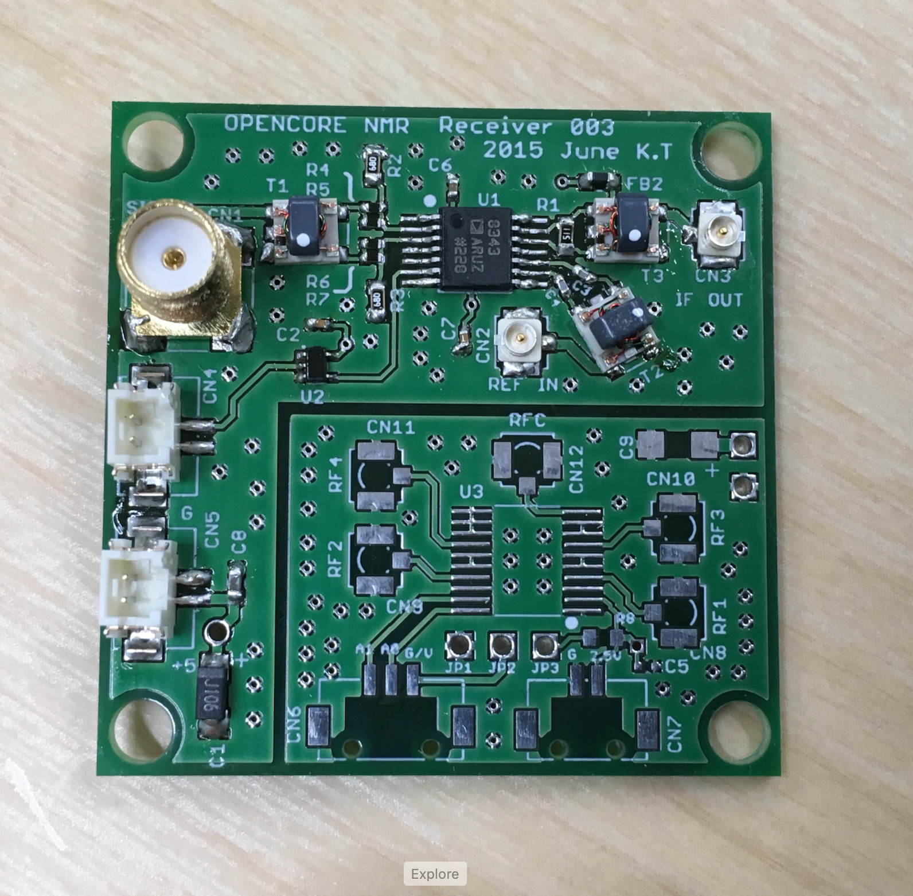
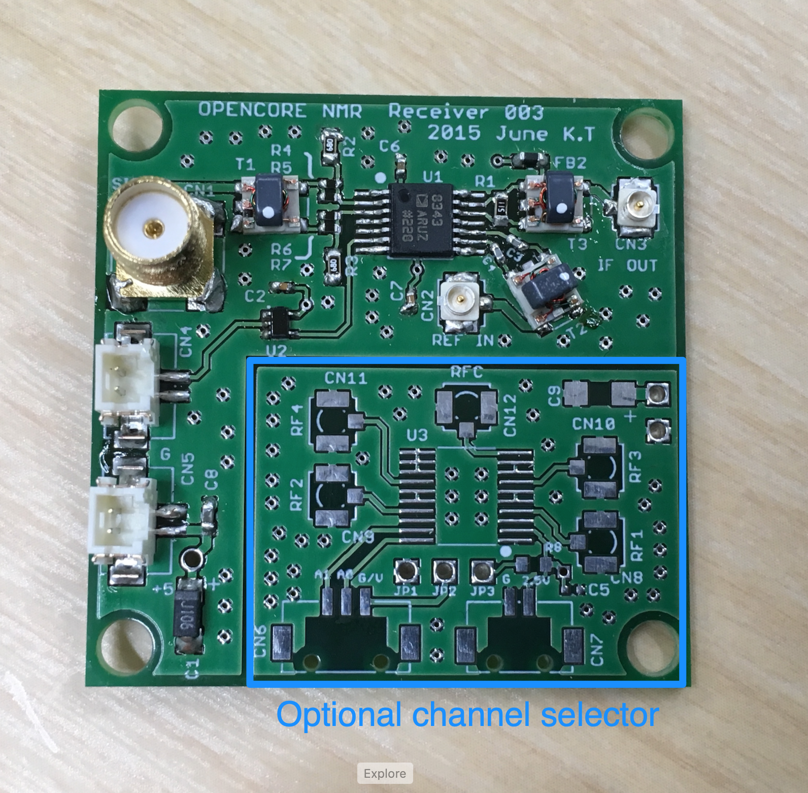
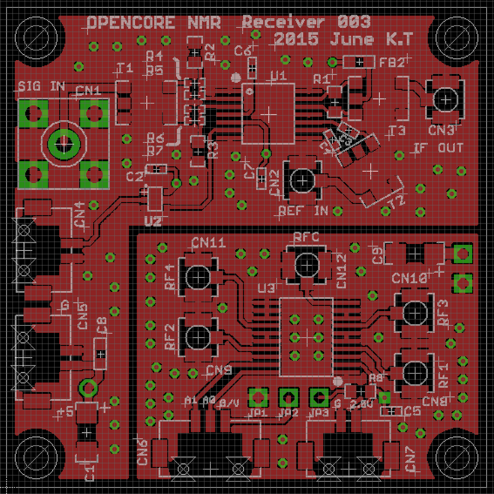
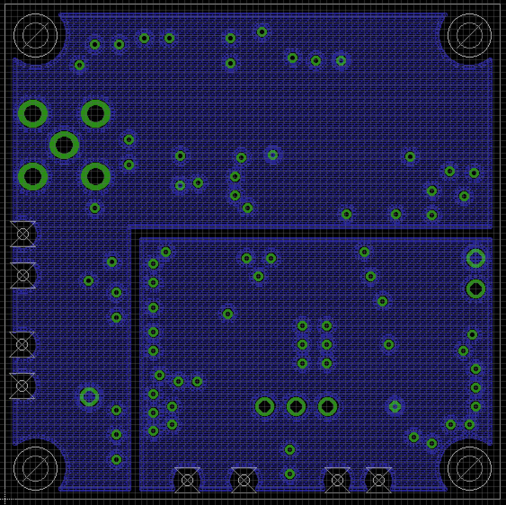
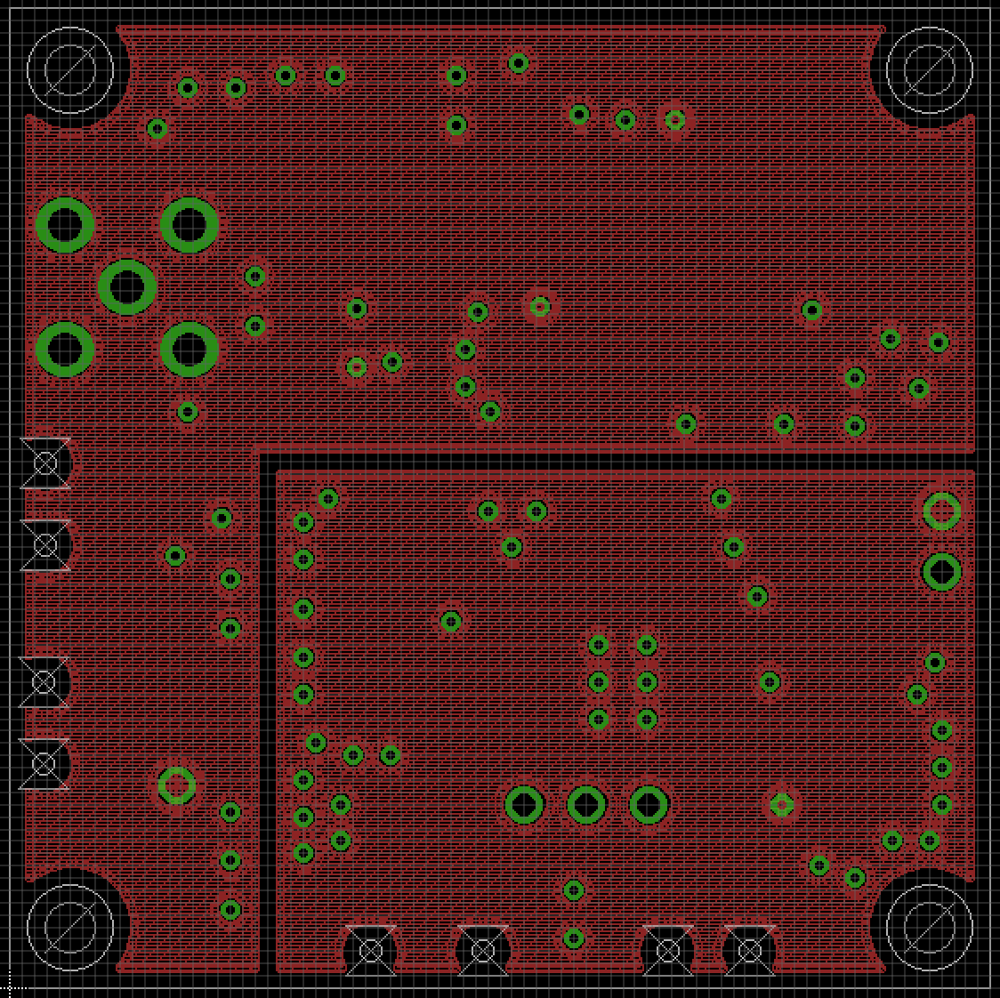
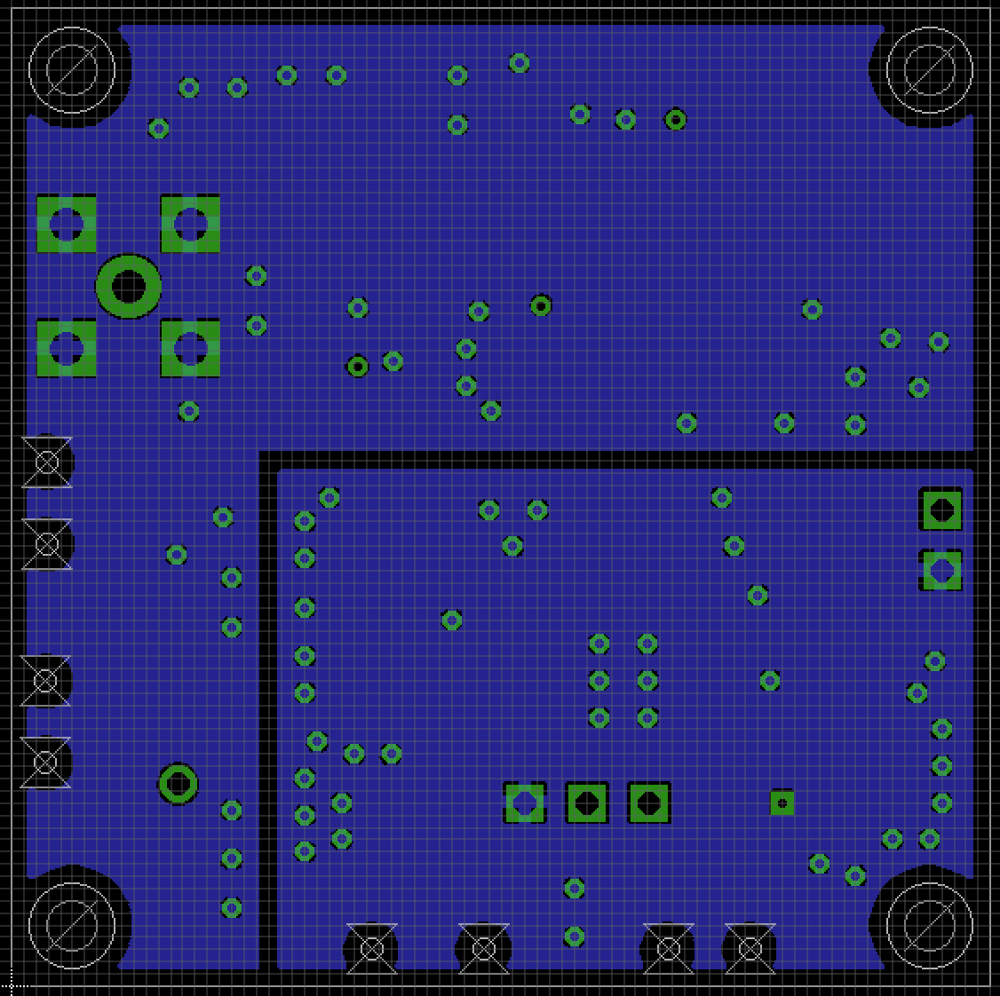

# Receiver

8 Mar 2019 document created by Kazuyuki Takeda

[Back to Home](../../index.md)  

- - -

Note that the right bottom part of the board serves for an optional receiver-channel selector. That is, you may leave this part blank, like the one in the photo shown here. In our lab we make fully use of it. How to built/use the channel selector will be described elsewhere.

### Board Design  

- The board was designed on EAGLE 6.2.0 Professional  
- There are **4 layers**. That is, in addition to the top and bottom layers, the board has two inner layers.  

##### EAGLE schematic and board files
- Schematic: [rcvr003.sch](data/rcvr003.sch)  
- Board: [rcvr003.brd](data/rcvr003.brd)  

##### Gerber files

- [rcvr003.cmp](data/gerber/rcvr003.cmp) (Component side pattern)
- [rcvr003.plc](data/gerber/rcvr003.plc)（Component side silkscreen)
- [rcvr003.sol](data/gerber/rcvr003.sol)（Solder side pattern）
- [rcvr003.stc](data/gerber/rcvr003.stc)（Component side solder resist）
- [rcvr003.sts](data/gerber/rcvr003.sts)（Solder side solder resist）
- [rcvr003.pls](data/gerber/rcvr003.pls)（Solder side silkscreen）
- [rcvr003.2l](data/gerber/rcvr003.2l)（2nd (inner) layer pattern）
- [rcvr003.3l](data/gerber/rcvr003.3l)（3rd (inner) layer pattern）
- [rcvr003.out](data/gerber/rcvr003.out)（outline）
- [rcvr003.dri](data/gerber/rcvr003.dri) (drill list）
- [rcvr003.drd](data/gerber/rcvr003.drd)（drill data）

**Note**: The *component side* mean the top (1st) layer, while the *solder side* does the bottom layer.

##### Component layer
  

##### 2nd (inner) layer
  

##### 3rd (inner) layer
  

##### Bottom layer
  

### Parts List

Part| 	Value | 	Device | 	Package	| Description
---|---|---|---|---
C1  | 10u	  | Tantalum Capacitor |3216 (polar) 	|
C2  | 0.01u	| Capacitor	| 1005	|
C3  | 0.1u	| Capacitor	| 1005	|
C4  | 0.1u	| Capacitor	| 1005	|
C5  | 0.1u	| Capacitor	| 1005	|
C6  | 0.1u	| Capacitor	| 1005	|
C7  | 0.01u	| Capacitor	| 1005	|
C8  | 0.01u	| Capacitor	| 1608	|
C9  | 10u	  | Tantalum Capacitor | 3216 (polar)	|
CN1 | |  SMA Straight
CN2 | |  U.FL-R-SMT |		| HIROSE
CN3 | |  U.FL-R-SMT | 	| HIROSE
CN4 | |  DF13-2P-1.25V	| 	
CN5 | |  DF13-2P-1.25V	| 	
CN6 | |  DF13-3P-1.25V	| 	
CN7 | |  DF13-2P-1.25V	| 	
CN8 | |  U.FL-R-SMT |		| HIROSE
CN9 | |  U.FL-R-SMT |		| HIROSE
CN10|	|  U.FL-R-SMT |		| HIROSE
CN11|	|  U.FL-R-SMT |		| HIROSE
CN12|	|  U.FL-R-SMT |		| HIROSE
FB2  |  30 Ohm @ 100 MHz   |  MPZ1608S300A   | 1608   | Ferrite bead (TDK)    
R1  |	  510 | Resistor	| 1608
R2  |	  68  | Resistor	| 1608
R3  |	  68  | Resistor	| 1608
R4  |	  10  | Resistor	| 1005
R5  |	  10  | Resistor	| 1005
R6  |	  10  | Resistor	| 1005
R7  |	  10  | Resistor	| 1005
R8  |	  100 |  Resistor	| 1608
T1  |	  | TC4-1W+	   |  AT224	| RF transformer (Mini Circuits)
T2  |	  | TC1-1-13M+ | 	AT224	| RF transformer (Mini Circuits)
T3  |	  | TC4-1W+    | 	AT224	| RF transformer (Mini Circuits)
U1  |	  | AD8343     | 		
U2  |	  | MC74VHC1G04| 	 | Logic Inverter
U3  |	  | ADG904     | 	TSSOP

- - -
[Back to Top](../../index.md)
